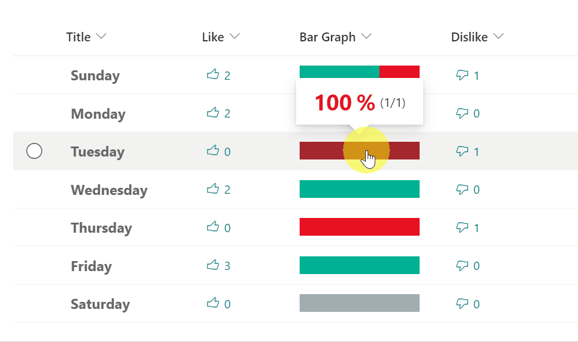

# Like/Dislike Bar

## Summary
This sample demonstrates displaying a Like/Dislike bar that visualizes the ratio of Like to Dislike users.

You can combine this sample with the [multi-person-unique-reaction](../multi-person-reaction/) sample, to incorporate Like and Dislike buttons.

## View requirements
This format can be applied to any column type but expects the following columns to be part of the view:

|Type                    |Internal Name  |Required|
|------------------------|---------------|:------:|
|Person or Group (Multi) |Like           |No      |
|Person or Group (Multi) |Dislike        |No      |

## Sample

Solution|Author(s)
--------|---------
generic-like-dislike-bar.json | [Tetsuya Kawahara](https://github.com/tecchan1107)

## Version history

Version |Date           |Comments
--------|---------------|--------
1.0     |March 20, 2022 |Initial release

## Disclaimer
**THIS CODE IS PROVIDED *AS IS* WITHOUT WARRANTY OF ANY KIND, EITHER EXPRESS OR IMPLIED, INCLUDING ANY IMPLIED WARRANTIES OF FITNESS FOR A PARTICULAR PURPOSE, MERCHANTABILITY, OR NON-INFRINGEMENT.**

