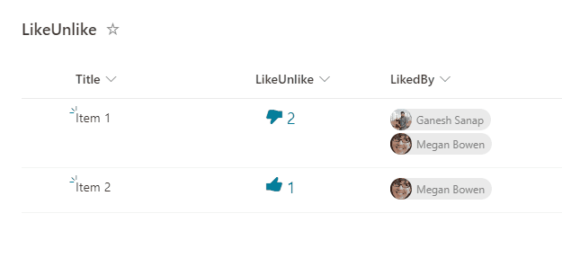

# Like/Unlike list item

## Summary

This column formatting sample demonstrates how to like/unlike a list item. This sample uses the setValue of customRowAction to update the number and person or group field.

## View requirements

This format can be applied to any column type (its value is ignored). In addition, below fields needs to be defined:

|Type               |Internal Name|Required|Comments|
|-------------------|-------------|--------|--------|
|Number|LikesCount      |No      |Default value = 0|
|Person or Group|LikedBy      |No      |Allow multiple selections|

## Sample

Solution                       |Author(s)
-------------------------------|---------------------------
generic-like-unlike.json |[Ganesh Sanap](https://twitter.com/GaneshSanap20)

## Version history

Version |Date          |Comments
--------|--------------|--------------------------------
1.0     |November 27, 2021 |Initial release

## Disclaimer

**THIS CODE IS PROVIDED *AS IS* WITHOUT WARRANTY OF ANY KIND, EITHER EXPRESS OR IMPLIED, INCLUDING ANY IMPLIED WARRANTIES OF FITNESS FOR A PARTICULAR PURPOSE, MERCHANTABILITY, OR NON-INFRINGEMENT.**

