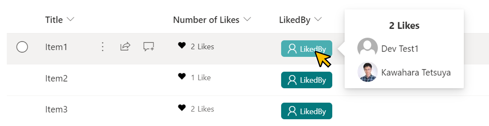

# Display users who have liked

## Summary
This sample demonstrates showing the users who have liked an item.



## Prerequisites
### Enabling the ratings feature
The ratings feature is available by default in the team site, but not in the communication site. If you want to use the ratings feature in the list of communication sites, you need to enable the feature GUID ` 915c240e-a6cc-49b8-8b2c-0bff8b553ed3`. The following is an example of how to enable it using [PnP PowerShell](https://pnp.github.io/powershell).

```
$targetURL = "https://<tenent name>.sharepoint.com/sites/<site name>"
Connect-PnPOnline -Url $targetURL -Interactive
Enable-PnPFeature –identity 915c240e-a6cc-49b8-8b2c-0bff8b553ed3 -Scope site
Disconnect-PnPOnline
```

### Add a ratings feature to the list
1. Click **gear icon**
2. Click **List Settings**
3. Under **General Settings**, click **Rating settings**.

   

4. Under **Allow items in this list to be rated?**, click **Yes**.
5. Under **Which voting/rating experience would you like to enable for this list?**, click **Likes**.
6. Click **OK**.

   

## View requirements

- Add a ratings feature to the list and display a like button.
- In addition, one field needs to be defined

|Type               |Internal Name|Required|
|-------------------|-------------|:------:|
|Single line of text|LikedBy      |No      |

## Sample

Solution             |Author(s)
---------------------|------------------------------------------------
generic-likedby.json |[Tetsuya Kawahara](https://twitter.com/techan_k)

## Version history

Version |Date            |Comments
--------|----------------|----------------
1.0     |October 22, 2021|Initial release

## Disclaimer
**THIS CODE IS PROVIDED *AS IS* WITHOUT WARRANTY OF ANY KIND, EITHER EXPRESS OR IMPLIED, INCLUDING ANY IMPLIED WARRANTIES OF FITNESS FOR A PARTICULAR PURPOSE, MERCHANTABILITY, OR NON-INFRINGEMENT.**

## Additional notes
- [PnP PowerShell](https://pnp.github.io/powershell)
- [Add a ratings feature to your library](https://support.microsoft.com/en-us/office/add-a-ratings-feature-to-your-library-5901fcfd-19ca-4f27-a65f-284654298552)

