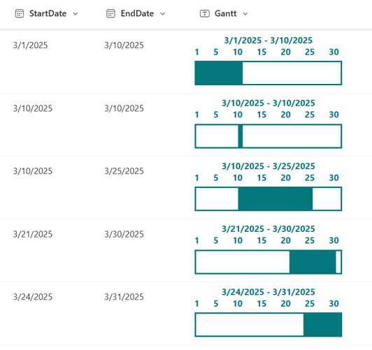

# Monthly Gantt Chart

## Summary
This sample demonstrates the display of a monthly Gantt chart. The Gantt chart for the month corresponding to the `StartDate` value will be shown. For example, if the `StartDate` is March 15, the Gantt chart for March will be displayed; if the `StartDate` is April 2, the Gantt chart for April will be shown.

## View requirements
This format can be applied to any column type but expects the following columns to be part of the view:

|Type|Internal Name|Required|
|---|---|:---:|
|Date and Time|StartDate|Yes|
|Date and Time|EndDate|Yes|

## Sample

Solution|Author(s)
--------|---------
generic-monthly-gantt-chart.json | [Ahmed Mandour](https://github.com/AMandour)

## Version history

Version |Date              |Comments
--------|------------------|--------
1.0     |February 16, 2025 |Initial release

## Disclaimer
**THIS CODE IS PROVIDED *AS IS* WITHOUT WARRANTY OF ANY KIND, EITHER EXPRESS OR IMPLIED, INCLUDING ANY IMPLIED WARRANTIES OF FITNESS FOR A PARTICULAR PURPOSE, MERCHANTABILITY, OR NON-INFRINGEMENT.**

---

## Additional notes

- This sample uses SVG to display the Gantt chart. The [generic-time-schedule](../generic-time-schedule/) displays a time-based schedule using the same approach.

