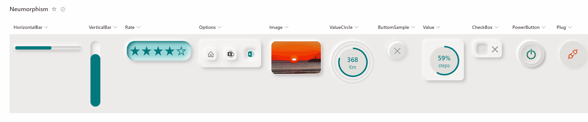
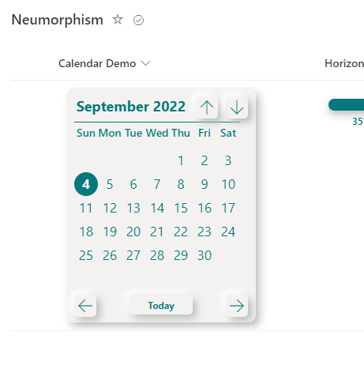

# Neumorphism samples

## Summary
This sample demostrate how to customize columns using neumorphism design.

### Calendar Feature

## View requirements

The format expect the following fields:
|Field                |Type
|-------------------|-------------
|Rate| Number - Select star option to rate value from (1-5). Since shadows cannot be added dynamically it's recommended to manualy update following line `inset 5px 5px 10px #03787c` with color associated to Theme.
|Options|Choice - Select choice from predefined values (**Home, SharePoint, Admin**)
|CheckBox|Yes/No - Select Yes/No with checkbox look and fell
|PowerButton|Yes/No - Select Yes/No with PowerButton look and fell
|Plug|Yes/No - Select Yes/No with Plug look and fell
|ButtomSample|Yes/No - Select Yes/No with button look and fell
|Image|Image - Image look and fell
|ValueCircle|Number - Circle Doughnut look and fell. Values from (0.0 to 1). Using existing sample [Doughnut Chart](https://github.com/pnp/List-Formatting/tree/master/column-samples/number-doughnut-chart)
|ValueSquare|Number - Square Doughnut look and fell. Values from (0.0 to 1). Using existing sample [Doughnut Chart](https://github.com/pnp/List-Formatting/tree/master/column-samples/number-doughnut-chart) 
|VerticalBar| Number - Display vertical bar. Select value from (1-100).
|HorizontalBar| Number - Display horizontal bar. Select value from (1-100).
|Calendar| Date - Display calendar where user can select date. Create column with name "CalendarDemo" of type DateTime.

## Sample

Access to Column Settings > Format this column and copy/past format from associated json column type. 

Solution|Author(s)
--------|---------
generic-neumorphism-rate.json | [André Lage](https://twitter.com/aaclage)
generic-neumorphism-options.json | [André Lage](https://twitter.com/aaclage)
generic-neumorphism-checkbox.json |[André Lage](https://twitter.com/aaclage)
generic-neumorphism-powerbutton.json | [André Lage](https://twitter.com/aaclage)
generic-neumorphism-plug.json |  [André Lage](https://twitter.com/aaclage)
generic-neumorphism-button.json | [André Lage](https://twitter.com/aaclage)
generic-neumorphism-image.json | [André Lage](https://twitter.com/aaclage)
generic-neumorphism-circledoughnut.json | [André Lage](https://twitter.com/aaclage)
generic-neumorphism-squaredoughnut.json | [André Lage](https://twitter.com/aaclage)
generic-neumorphism-verticalbar.json | [André Lage](https://twitter.com/aaclage)
generic-neumorphism-horizontalbar.json | [André Lage](https://twitter.com/aaclage)
generic-neumorphism-calendar.json | [André Lage](https://twitter.com/aaclage)

## Version history

Version|Date|Comments
-------|----|--------
1.0|July 11, 2022|Initial release

## Disclaimer
**THIS CODE IS PROVIDED *AS IS* WITHOUT WARRANTY OF ANY KIND, EITHER EXPRESS OR IMPLIED, INCLUDING ANY IMPLIED WARRANTIES OF FITNESS FOR A PARTICULAR PURPOSE, MERCHANTABILITY, OR NON-INFRINGEMENT.**

---

## Additional notes

