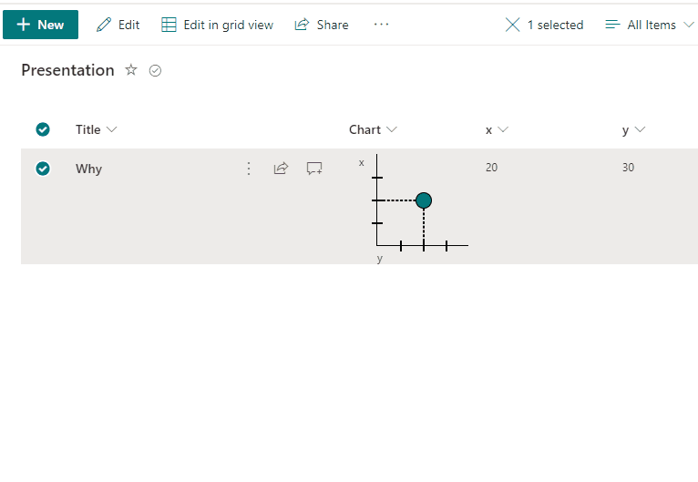

# One Point Chart

## Summary
This sample demonstrates making one point chart with support of 2 numeric fields (x,y) with dialog description.

## View requirements

The format expect the following fields:
|Field                |Type
|-------------------|-------------
|Chart| Single line of text - Format (generic-one-point-chart.json) is added in this column        
|x|Number - x position
|y|Number - y position

## Sample

Solution|Author(s)
--------|---------
generic-one-point-chart.json | [André Lage](https://twitter.com/aaclage)

## Version history

Version|Date|Comments
-------|----|--------
1.0|March 12, 2022|Initial release

## Disclaimer
**THIS CODE IS PROVIDED *AS IS* WITHOUT WARRANTY OF ANY KIND, EITHER EXPRESS OR IMPLIED, INCLUDING ANY IMPLIED WARRANTIES OF FITNESS FOR A PARTICULAR PURPOSE, MERCHANTABILITY, OR NON-INFRINGEMENT.**

---

## Additional notes

