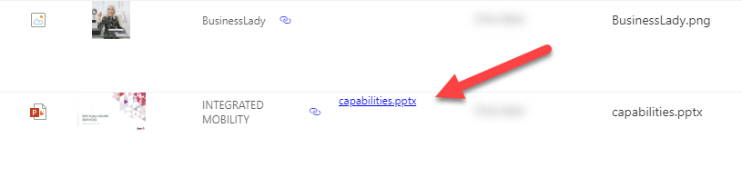

# Open File as PDF

## Summary
This sample can be applied to a column in a Document Library to render a link that will open an Office Document as a pdf. It relies on the SharePoint 2.0 rest api. The `YOUR_DRIVE_ID` placeholder in the json needs to be replaced with the correct driveurl for the document library where the format is being used.

To Get the driveurl navigate to

https://--tenant--.sharepoint.com/sites/--sitename--/_api/v2.0/drives

replacing the --tenant-- and --sitename-- placeholders with approriate values.

Find the entry where the "name" attribute is the Title of the library where you want to use this JSON. Select the coresponding `id` attribute and paste it into the JSON template, replacing `YOUR_DRIVE_ID` 

The id will look similar to `b!oqbo5Yz5ekialDrzcav5R3esotWm9VxCmi6bA63L7Wfuozp-JfhPTaVlFzxUdRwa`

## View requirements
This format can be applied to any column type within a document library.

## Sample

Solution|Author(s)
--------|---------
generic-open-file-as-pdf.json | [Russell Gove](https://github.com/russgove) ([@russgove](https://twitter.com/rossgove))

## Version history

Version|Date|Comments
-------|----|--------
1.0|October 28, 2020|Initial release
1.1|July 7, 2022|Added `@currentWeb` usage

## Disclaimer
**THIS CODE IS PROVIDED *AS IS* WITHOUT WARRANTY OF ANY KIND, EITHER EXPRESS OR IMPLIED, INCLUDING ANY IMPLIED WARRANTIES OF FITNESS FOR A PARTICULAR PURPOSE, MERCHANTABILITY, OR NON-INFRINGEMENT.**

---

## Additional notes

