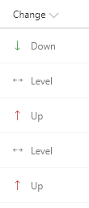

# Project Indicator Formats

## Summary

Three related formats for use in project management.

## Color-coded status (generic-project-management.json)

Text or choice column where the value is used to determine the color. This allows for an easy visualization of status. To use a lookup column instead, replace all occurences of `@currentField` with `@currentField.lookupValue`.

This format uses the values Red, Yellow, Green, and Amber but you could easily extend this to fit your own color-coded system by adding or removing nested conditions.

## Color-coded score ranges (risk-score.json)

A number column is evaluated against tiers of values to provide colors corresponding to score ranges. This format provides 4 ranges:

|Range|Color|
|---|---|
|value >= 16|Red|
|16 > value >= 12|OrangeLighter|
|12 > value >= 8|Yellow|
|value < 8|Green|

You can easily adjust the values/colors to provide your own ranges. You can also add or remove nested conditions to increase or decrease the number of ranges needed.

## Change direction indicator (risk-level-change-status.json)

A text or choice column where the value is represented as a colored icon. The color is provided using column formatting [predefined classes](https://docs.microsoft.com/en-us/sharepoint/dev/declarative-customization/column-formatting#predefined-classes) which are applied based on the text of the field. Similarly, [UI Fabric icons](https://developer.microsoft.com/en-us/fabric#/styles/icons) provide an additional visualization for the value. To use a lookup column instead, replace all occurences of `@currentField` with `@currentField.lookupValue`.

|Value|Class|Icon|
|---|---|---|
|Down|sp-field-trending--up|SortDown|
|Level||Split|
|Up|sp-field-trending--down|SortUp|

## Combined formats

Combining more than one of the above formats in a single listview can easily tranform your list into an intuitive and powerful dashboard.

## View requirements

### ryg-status.json
- This format should be applied to a text or choice field with values of Green, Yellow, Red, or Amber

### risk-score.json
- This format should be applied to a Number column

### risk-level-change-status.json
- This format should be applied to a text or choice field with values of Down, Level, or Up

## Sample

Solution|Author(s)
--------|---------
generic-project-management.json | [S Merchant](https://github.com/sohailmerchant) ([@sohailmerchant](https://twitter.com/sohailmerchant))
risk-level-change-status.json | [S Merchant](https://github.com/sohailmerchant) ([@sohailmerchant](https://twitter.com/sohailmerchant))
risk-score.json | [S Merchant](https://github.com/sohailmerchant) ([@sohailmerchant](https://twitter.com/sohailmerchant))

## Version history

Version|Date|Comments
-------|----|--------
1.0|November 10, 2017|Initial release
1.1|March 22, 2018|Bug fixes and style adjustments
1.2|August 20, 2018|Updated to use Excel-style expressions and theme color classes

## Disclaimer
**THIS CODE IS PROVIDED *AS IS* WITHOUT WARRANTY OF ANY KIND, EITHER EXPRESS OR IMPLIED, INCLUDING ANY IMPLIED WARRANTIES OF FITNESS FOR A PARTICULAR PURPOSE, MERCHANTABILITY, OR NON-INFRINGEMENT.**

---

## Additional notes

> Additional versions using Abstract Tree Syntax (AST) are also provided for environments where the Excel-style expressions are not supported.

