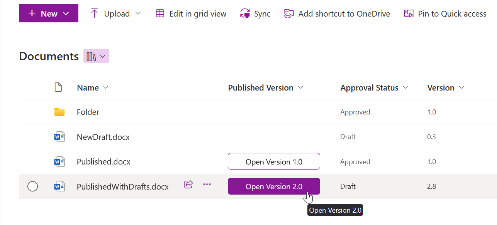

# Published Version

## Summary
This sample creates a button for opening the currently published version of a document. The sample is supposed to be used in a SharePoint Online document library with minor versions enabled. Button is displayed for every document with a published version, i.e., at version at least 1.0. It is linked to the latest published version of the document - for example, if the latest draft of the document is at version 2.8, the button opens version 2.0.

> [!NOTE]  
> The behavior of the button varies in different browsers and for different file types. For Office documents in **Microsoft Edge**, the button opens the file directly from SharePoint in the installed app. In other browsers, the button usually downloads the document, optionally opening it after download, based on settings.

## View requirements
- This format can be applied to any column type

## Sample

Solution|Author(s)
--------|---------
generic-published-version.json | [Miroslav Kačena](https://github.com/mkacena) ([@MiroslavKacena](https://x.com/MiroslavKacena))

## Version history

Version|Date|Comments
-------|----|--------
1.0|October 7, 2024|Initial release

## Disclaimer

**THIS CODE IS PROVIDED *AS IS* WITHOUT WARRANTY OF ANY KIND, EITHER EXPRESS OR IMPLIED, INCLUDING ANY IMPLIED WARRANTIES OF FITNESS FOR A PARTICULAR PURPOSE, MERCHANTABILITY, OR NON-INFRINGEMENT.**

---

## Additional notes

None

