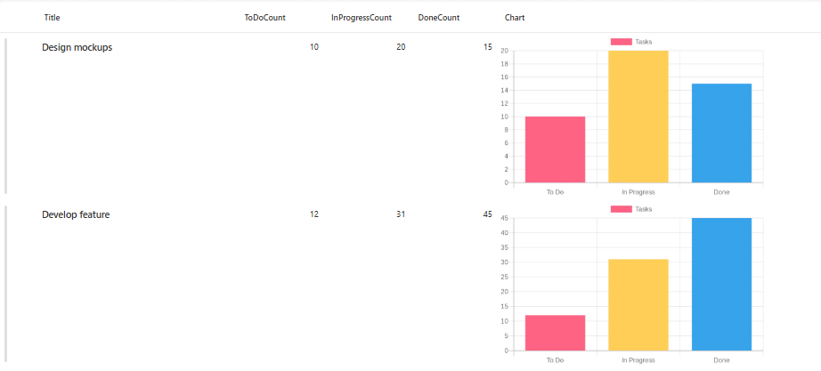

# Bar Chart Column Formatter

This sample uses **SharePoint List Formatting** to automatically generate a bar chart visualization for task status counts in each list item.  
Each row displays a dynamically generated bar chart showing the distribution of tasks across three states: "To Do", "In Progress", and "Done", making it easy to visualize project or task progress at a glance.



## View Requirements

Create a list with the following columns:

| Internal Name        | Type    |
|---------------------|---------|
| **Title**       | Single line of text  |
| **ToDoCount**       | Number  |
| **InProgressCount** | Number  |
| **DoneCount**       | Number  |
| **Charts**       | Single line of text  |

*Note: Additional columns can be added as needed for your specific use case.*

## Sample Data

| ToDoCount | InProgressCount | DoneCount |
|-----------|----------------|-----------|
| 5         | 3              | 12        |
| 8         | 2              | 5         |
| 0         | 4              | 16        |

## How it Works

- The formatter displays a **bar chart** for each list item based on task status counts
- Charts are generated dynamically using the [QuickChart.io API](https://quickchart.io/)
- Each bar chart visualizes three data segments with unique colors:
  - **To Do** (Red - #FF6384)
  - **In Progress** (Yellow - #FFCE56)
  - **Done** (Blue - #36A2EB)
- The layout displays charts at 400x250 pixels with rounded corners
- The chart automatically updates when column values change

## Security Configuration

**CRITICAL**: Before the charts will display, you must configure SharePoint security settings:

1. Navigate to **SharePoint Admin Center**
2. Go to **Settings** > **Advanced Settings**  
3. Find **"HTML Field Security"** section
4. Add `quickchart.io` to the **allowed domains** list
5. Save the configuration

**Without this security configuration, charts will not display due to SharePoint's content security policies.**

## Sample

Solution|Author
--------|---------
generic-quick-charts-bar-chart.json | [Sai Bandaru](https://github.com/saiiiiiii) ([LinkedIn](https://www.linkedin.com/in/sai-bandaru-97a946153/))

## Version history

Version|Date|Comments
-------|----|--------
1.0|October 08, 2025|Initial release

## Disclaimer
**THIS CODE IS PROVIDED *AS IS* WITHOUT WARRANTY OF ANY KIND, EITHER EXPRESS OR IMPLIED, INCLUDING ANY IMPLIED WARRANTIES OF FITNESS FOR A PARTICULAR PURPOSE, MERCHANTABILITY, OR NON-INFRINGEMENT.**

---

**Change Bar Colors:**
Modify the backgroundColor hex codes in the URL:
- Current: `%23FF6384` (Red), `%23FFCE56` (Yellow), `%2336A2EB` (Blue)
- Replace with your preferred colors (remember to URL-encode the # symbol as %23)

**Adjust Chart Size:**
Modify the dimensions in the style section:
```json
"style": {
  "width": "500px",
  "height": "300px"
}
```

**Change Chart Labels:**
The labels are URL-encoded in the chart URL. To customize labels, modify the `labels` array in the decoded URL:
- Current: `["To Do","In Progress","Done"]`
- Modify as needed for your use case

**Customize Dataset Label:**
Change `label:%22Tasks%22` to any text you prefer (URL-encode the text)

**Border Radius:**
Adjust the `border-radius` value to change corner roundness (use `"0px"` for square corners)

### Use Cases
- **Project Management**: Visualize task completion status across multiple projects
- **Sprint Tracking**: Monitor work items in agile development workflows
- **Resource Allocation**: Display distribution of team members across different work states
- **Quality Assurance**: Track bug status distribution (open, in progress, resolved)
- **Sales Pipeline**: Visualize deals across different pipeline stages
- **Support Tickets**: Monitor ticket distribution by status
- **Inventory Management**: Track stock levels across different categories

### Chart URL Structure

The QuickChart URL uses the Chart.js configuration format (URL-encoded):
```
https://quickchart.io/chart?c={
  type: "bar",
  data: {
    labels: ["To Do","In Progress","Done"],
    datasets: [{
      label: "Tasks",
      data: [5,3,12],
      backgroundColor: ["#FF6384","#FFCE56","#36A2EB"]
    }]
  }
}
```

### Color Palette

The default color scheme uses:
- **Red (#FF6384)**: Represents "To Do" tasks - typically indicating pending work
- **Yellow (#FFCE56)**: Represents "In Progress" tasks - showing active work
- **Blue (#36A2EB)**: Represents "Done" tasks - completed work

You can customize these colors to match your organization's branding or create different visual meanings.

### Limitations
- Requires internet connectivity for chart generation
- External dependency on QuickChart.io API
- Performance may vary with large lists due to multiple API calls
- Limited customization without modifying the URL-encoded chart configuration
- Chart renders as a static image (not interactive)

### Advanced Customization

For more advanced chart customization (colors, legends, etc.), you can modify the Chart.js configuration in the URL. Refer to the [QuickChart.io documentation](https://quickchart.io/documentation/) for available options.

## License
This formatting solution is provided as-is for educational and professional use. The QuickChart.io API has its own terms of service.

