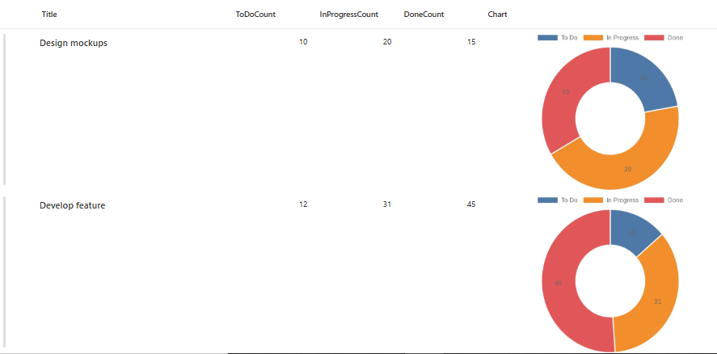
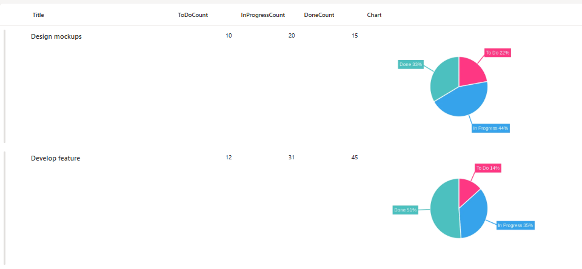
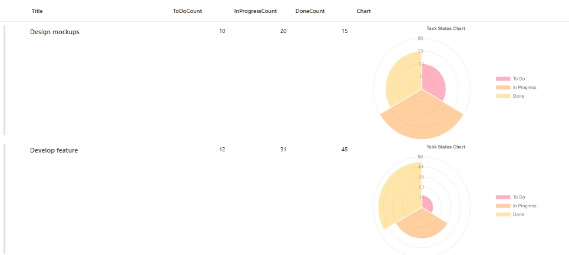

# Task Status Chart Column Formatters

This collection provides **three different chart visualizations** for task status data in SharePoint lists using column formatting. Each formatter automatically generates dynamic charts showing the distribution of tasks across "To Do", "In Progress", and "Done" states.

## Available Chart Types

This sample includes three chart variations:

1. **doughnut Chart** (`generic-quick-charts-doughnut.json`) - Classic doughnut with automatic colors
2. **Outlabeled Pie Chart** (`generic-quick-charts-outlabeledPie.json`) - Enhanced pie chart with labels outside segments
3. **Polar Area Chart** (`generic-quick-charts-polararea.json`) - Polar area chart with legend and title

## View Requirements

Create a list with the following columns:

| Internal Name        | Type    |
|---------------------|---------|
| **Title**       | Single line of text  |
| **ToDoCount**       | Number  |
| **InProgressCount** | Number  |
| **DoneCount**       | Number  |
| **Charts**       | Single line of text  |

*Note: Additional columns can be added as needed for your specific use case.*

## Sample Data

| ToDoCount | InProgressCount | DoneCount |
|-----------|----------------|-----------|
| 5         | 3              | 12        |
| 8         | 2              | 5         |
| 0         | 4              | 16        |

## Chart Variations

### 1. Doughnut Chart
- Clean, simple doughnut chart visualization
- Automatic color assignment by QuickChart.io
- Ideal for basic status visualization
- File: `generic-quick-charts-doughnut.json`

### 2. Outlabeled Pie Chart
- Labels positioned outside pie segments
- Custom colors: Red (#FF3784), Blue (#36A2EB), Teal (#4BC0C0)
- Displays label name and percentage ("%l %p")
- Responsive font sizing (12-18px)
- File: `generic-quick-charts-pie-outlabeled.json`

### 3. Polar Area Chart
- Polar area visualization with semi-transparent segments
- Right-positioned legend
- Chart title: "Task Status Chart"
- Custom RGBA colors with 50% opacity
- File: `generic-quick-charts-polararea.json`

## How it Works

- The formatter displays a **doughnut chart** for each list item based on task status counts
- Charts are generated dynamically using the [QuickChart.io API](https://quickchart.io/)
- Each doughnut chart visualizes three data segments:
  - **To Do** (first segment)
  - **In Progress** (second segment)
  - **Done** (third segment)
- The layout displays charts at 400x250 pixels with rounded corners
- The chart automatically updates when column values change

## Security Configuration

**CRITICAL**: Before the charts will display, you must configure SharePoint security settings:

1. Navigate to **SharePoint Site**
2. Go to **Site Settings**
3. Find **"HTML Field Security"** section
4. Add `quickchart.io` to the **allowed domains** list
5. Save the configuration

**Without this security configuration, charts will not display due to SharePoint's content security policies.**

## Sample

Solution|Author
--------|---------
generic-quick-charts-doughnut.json | [Sai Bandaru](https://github.com/saiiiiiii) ([LinkedIn](https://www.linkedin.com/in/sai-bandaru-97a946153/))
generic-quick-charts-outlabeledPie.json | [Sai Bandaru](https://github.com/saiiiiiii) ([LinkedIn](https://www.linkedin.com/in/sai-bandaru-97a946153/))
generic-quick-charts-polararea.json | [Sai Bandaru](https://github.com/saiiiiiii) ([LinkedIn](https://www.linkedin.com/in/sai-bandaru-97a946153/))

## Version history

Version|Date|Comments
-------|----|--------
1.0|October 13, 2025|Initial release

## Disclaimer
**THIS CODE IS PROVIDED *AS IS* WITHOUT WARRANTY OF ANY KIND, EITHER EXPRESS OR IMPLIED, INCLUDING ANY IMPLIED WARRANTIES OF FITNESS FOR A PARTICULAR PURPOSE, MERCHANTABILITY, OR NON-INFRINGEMENT.**

## Limitations
- Requires internet connectivity for chart generation
- External dependency on QuickChart.io API availability
- Performance may vary with large lists due to multiple API calls
- Maximum URL length restrictions may apply for complex configurations
- Charts may take a moment to render on initial page load

## Advanced Customization

You can customize the charts by modifying the URL-encoded Chart.js configuration:

- **Colors**: Modify `backgroundColor` arrays with hex or rgba values
- **Labels**: Change text in the `labels` array
- **Legend Position**: Adjust `legend.position` (top, bottom, left, right)
- **Chart Size**: Modify the `width` and `height` in the `style` section
- **Fonts**: Customize font sizes and families in chart options
- **Animations**: Add animation configurations to the options object

Refer to the [QuickChart.io documentation](https://quickchart.io/documentation/) and [Chart.js documentation](https://www.chartjs.org/docs/) for all available customization options.

## Troubleshooting

**Charts not displaying:**
- Verify `quickchart.io` is added to HTML Field Security settings
- Check that column internal names match exactly (case-sensitive)
- Ensure numeric columns contain valid numbers (not text)
- Clear browser cache and refresh the page

**Charts showing incorrect data:**
- Verify the column internal names in your JSON match your list columns
- Check that you're applying the formatter to the correct column
- Ensure numeric values are not null or empty

## Performance Tips

- For large lists (500+ items), consider using view filters to limit rendered items
- Use indexed columns for better filtering performance
- Consider caching strategies for frequently accessed lists
- Monitor QuickChart.io API usage and rate limits

## License
This formatting solution is provided as-is for educational and professional use. The QuickChart.io API has its own terms of service and usage limits. Please review their documentation for production use.

## Resources
- [SharePoint Column Formatting Documentation](https://docs.microsoft.com/en-us/sharepoint/dev/declarative-customization/column-formatting)
- [QuickChart.io Documentation](https://quickchart.io/documentation/)
- [Chart.js Documentation](https://www.chartjs.org/docs/)
- [JSON Schema for SharePoint](https://developer.microsoft.com/json-schemas/sp/v2/column-formatting.schema.json)

