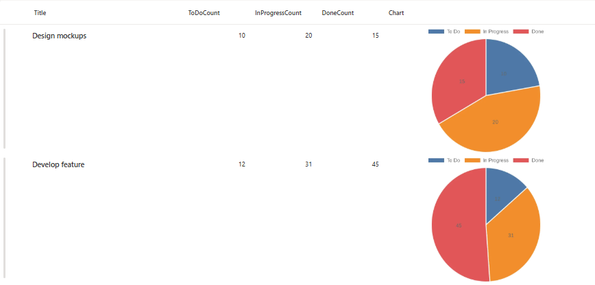

# Pie Chart Column Formatter

This sample uses **SharePoint List Formatting** to automatically generate a pie chart visualization for task status counts in each list item.  
Each row displays a dynamically generated pie chart showing the distribution of tasks across three states: "To Do", "In Progress", and "Done", making it easy to visualize project or task progress at a glance.



## View Requirements

Create a list with the following columns:

| Internal Name        | Type    |
|---------------------|---------|
| **Title**       | Single line of text  |
| **ToDoCount**       | Number  |
| **InProgressCount** | Number  |
| **DoneCount**       | Number  |
| **Charts**       | Single line of text  |

*Note: Additional columns can be added as needed for your specific use case.*

## Sample Data

| ToDoCount | InProgressCount | DoneCount |
|-----------|----------------|-----------|
| 5         | 3              | 12        |
| 8         | 2              | 5         |
| 0         | 4              | 16        |

## How it Works

- The formatter displays a **pie chart** for each list item based on task status counts
- Charts are generated dynamically using the [QuickChart.io API](https://quickchart.io/)
- Each pie chart visualizes three data segments:
  - **To Do** (first segment)
  - **In Progress** (second segment)
  - **Done** (third segment)
- The layout displays charts at 400x250 pixels with rounded corners
- The chart automatically updates when column values change

## Security Configuration

**CRITICAL**: Before the charts will display, you must configure SharePoint security settings:

1. Navigate to **SharePoint Site**
2. Go to **Site Settings**
3. Find **"HTML Field Security"** section
4. Add `quickchart.io` to the **allowed domains** list
5. Save the configuration

**Without this security configuration, charts will not display due to SharePoint's content security policies.**

## Sample

Solution|Author
--------|---------
generic-quick-charts-pie.json | [Sai Bandaru](https://github.com/saiiiiiii) ([LinkedIn](https://www.linkedin.com/in/sai-bandaru-97a946153/))

## Version history

Version|Date|Comments
-------|----|--------
1.0|October 08, 2025|Initial release

## Disclaimer
**THIS CODE IS PROVIDED *AS IS* WITHOUT WARRANTY OF ANY KIND, EITHER EXPRESS OR IMPLIED, INCLUDING ANY IMPLIED WARRANTIES OF FITNESS FOR A PARTICULAR PURPOSE, MERCHANTABILITY, OR NON-INFRINGEMENT.**

---

### Use Cases
- **Project Management**: Visualize task completion status across multiple projects
- **Sprint Tracking**: Monitor work items in agile development workflows
- **Resource Allocation**: Display distribution of team members across different work states
- **Quality Assurance**: Track bug status distribution (open, in progress, resolved)
- **Sales Pipeline**: Visualize deals across different pipeline stages
- **Support Tickets**: Monitor ticket distribution by status

### Chart URL Structure

The QuickChart URL uses the Chart.js configuration format (URL-encoded):
```
https://quickchart.io/chart?c={
  type: "pie",
  data: {
    labels: ["To Do","In Progress","Done"],
    datasets: [{
      data: [5,3,12]
    }]
  }
}
```

### Limitations
- Requires internet connectivity for chart generation
- External dependency on QuickChart.io API
- Performance may vary with large lists due to multiple API calls
- Chart colors are automatically assigned by QuickChart.io
- Limited customization without modifying the URL-encoded chart configuration

### Advanced Customization

For more advanced chart customization (colors, legends, etc.), you can modify the Chart.js configuration in the URL. Refer to the [QuickChart.io documentation](https://quickchart.io/documentation/) for available options.

## License
This formatting solution is provided as-is for educational and professional use. The QuickChart.io API has its own terms of service.

