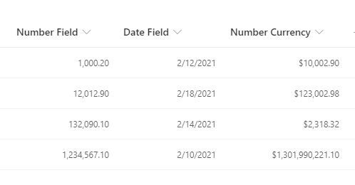

# Centered Content

## Summary
This sample shows how to right-align your content, while preserving the number or date format set using the SharePoint / Lists UI.  Numbers and dates should typically be presented as right-aligned, for improved readability.

Most existing json formatting samples or examples for this requirement (blog, forum posts, etc.) lose the number or date format, making them impractical to use as the result is hard to read. Some examples try to remedy this with complex string manipulation to reformat the values, which can be fragile. With the recent addition of `.displayValue` none of that is necessary!

Simply set the desired formatting using the SharePoint / Lists UI, and this sample will honor those settings while aligning them to the right.

## View requirements
- This format can be applied to any column type. It is best suited to numeric/currency or date columns.

## Sample

Solution|Author(s)
--------|---------
generic-right-align.json | [Mike Honey](https://www.linkedin.com/in/mikehoney/)

## Version history

Version|Date|Comments
-------|----|--------
1.0|February 13, 2021|Initial release

## Disclaimer
**THIS CODE IS PROVIDED *AS IS* WITHOUT WARRANTY OF ANY KIND, EITHER EXPRESS OR IMPLIED, INCLUDING ANY IMPLIED WARRANTIES OF FITNESS FOR A PARTICULAR PURPOSE, MERCHANTABILITY, OR NON-INFRINGEMENT.**

---

## Additional notes
None

