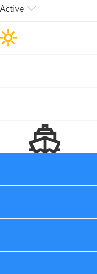

# Row Index Drawing

## Summary
This is a silly format that draws a picture in your view using the `@rowIndex` token to adjust the colors and to determine when certain pictures (icons or SVG elements) should show up.

Also included is the AquaticAssetsGenerator.ps1 PowerShell script that demonstrates creating lots of random entries in a list. You'll want at least 201 items to show the full picture.

## View requirements
- This format can be applied to any view

## Sample

Solution|Author(s)
--------|---------
generic-rowIndex-drawing.json | [Chris Kent](https://github.com/thechriskent)

## Version history

Version|Date|Comments
-------|----|--------
1.0|February 20, 2020|Initial release

## Disclaimer
**THIS CODE IS PROVIDED *AS IS* WITHOUT WARRANTY OF ANY KIND, EITHER EXPRESS OR IMPLIED, INCLUDING ANY IMPLIED WARRANTIES OF FITNESS FOR A PARTICULAR PURPOSE, MERCHANTABILITY, OR NON-INFRINGEMENT.**

---

## Additional notes

- [Use column formatting to customize SharePoint](https://docs.microsoft.com/en-us/sharepoint/dev/declarative-customization/column-formatting#me)

