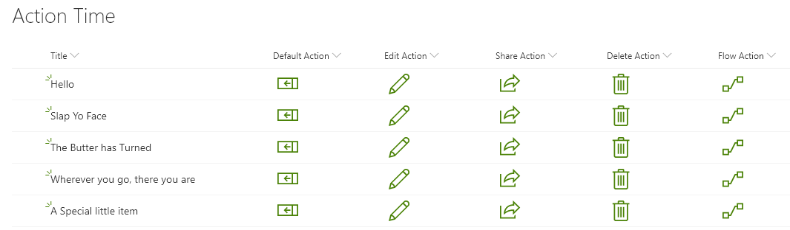

# Row Actions

## Summary
You can use column and view formatting to create buttons that perform pre-defined actions when clicked. This sample provides a quick format that demonstrates the use of each of the possible actions.

These samples are all built for column formatting, but these can be easily adapted to work with view formatting.

Custom row actions only work when placed inside of a `button` element. However, you can adjust the button's styles/children to customize the look entirely _(you can even wrap your entire format in a button - see the [bulletin-board-format](../../view-samples/bulletin-board-format) for an example)_.

### defaultClick
This action will open the info panel for an item.

### editProps
This action will open the info panel in edit mode

### share
This action will launch the share dialog for an item

### delete
This action will prompt the user with a deletion confirmation dialog and delete the item if they choose yes.

### executeFlow
This action will launch a flow for the item as the selected item. This action requires additional configuration through the `actionParams` property. The ID is always required, but you can also optionally include `headerText` and/or `runFlowButtonText` properties as well to customize the Flow panel.

#### To obtain a Flow's ID:

1. Click _Flow_ > _See your flows_ in the SharePoint list where the Flow is configured
2. Click on the Flow you want to run
3. Copy the ID from the end of the URL

## View requirements
- This format can be applied to any column type (its value is ignored)
- If using the `executeFlow` action, the list is expected to have an associated Flow, the ID of this flow needs to be included in the `actionParams` for the button

> Tip - You can apply these formats to a Calculated Column with a formula of `=""`. This prevents the fields from being part of your edit/new forms.

## Sample

Solution|Author(s)
--------|---------
defaultClick.json | [Chris Kent](https://twitter.com/thechriskent)
editProps.json | [Chris Kent](https://twitter.com/thechriskent)
share.json | [Chris Kent](https://twitter.com/thechriskent)
delete.json | [Chris Kent](https://twitter.com/thechriskent)
executeFlow.json | [Chris Kent](https://twitter.com/thechriskent)

## Version history

Version|Date|Comments
-------|----|--------
1.0|April 18, 2019|Initial release

## Disclaimer
**THIS CODE IS PROVIDED *AS IS* WITHOUT WARRANTY OF ANY KIND, EITHER EXPRESS OR IMPLIED, INCLUDING ANY IMPLIED WARRANTIES OF FITNESS FOR A PARTICULAR PURPOSE, MERCHANTABILITY, OR NON-INFRINGEMENT.**

---

## Additional notes

- Additional samples of the `executeFlow` action can be found here:
  - [generic-start-flow](../generic-start-flow)
  - [generic-start-flow-conditionally](../generic-start-flow-conditionally)

