# Row Actions

## Summary
You can use column and view formatting to create buttons that perform pre-defined actions when clicked. This sample provides several quick formats that demonstrates the use of each of the possible actions.

These samples are all built for column formatting, but these can be easily adapted to work with view formatting.

Custom row actions only work when placed inside of `button`, `div`, or `span` elements. However, you can adjust the element's styles/children to customize the look entirely _(you can even wrap your entire format in a button - see the [bulletin-board-format](../../view-samples/bulletin-board-format) for an example)_.

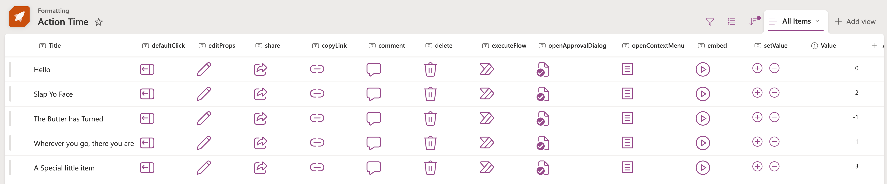

> Actions are supported in lists and libraries in SharePoint and Microsoft Lists

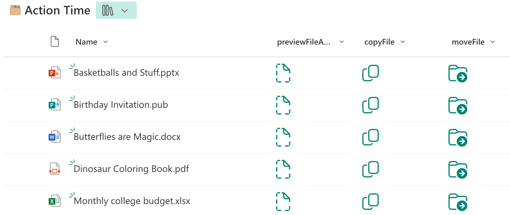

> Some actions, however, are only supported in document libraries

### defaultClick (generic-rowactions.json)
This action will open the list item. This is equivalent to double-clicking an item.

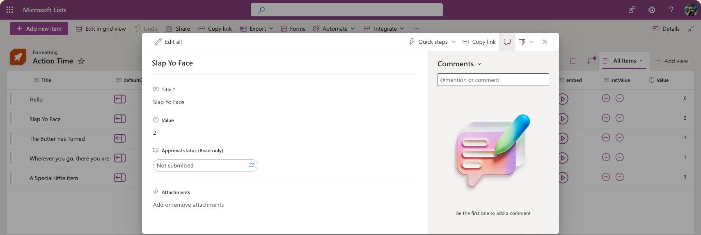

### editProps (editProps.json)
This action will open the list item in edit mode. This is equivalent to double-clicking an item and then pressing `Edit all`.

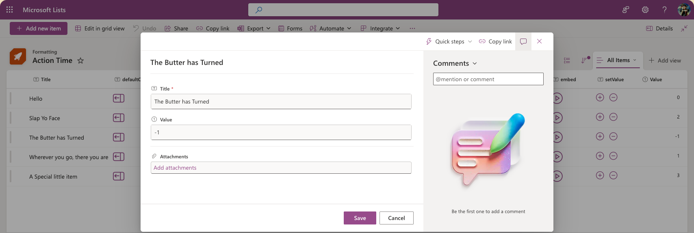

### share (share.json)
This action will launch the Share dialog for an item. This is equivalent to selecting the item and then pressing the `Share` command bar button.

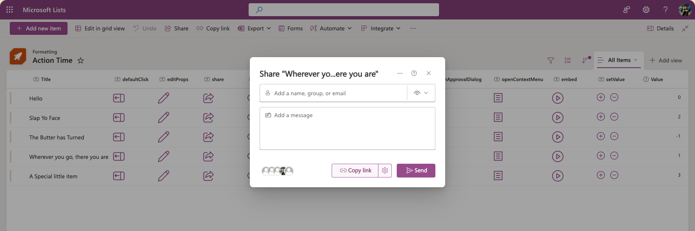

### copyLink (copyLink.json)
This action will launch the Copy Link dialog for an item and copy the link to the clipboard. This is equivalent to selecting the item and then pressing the `Copy link` command bar button.

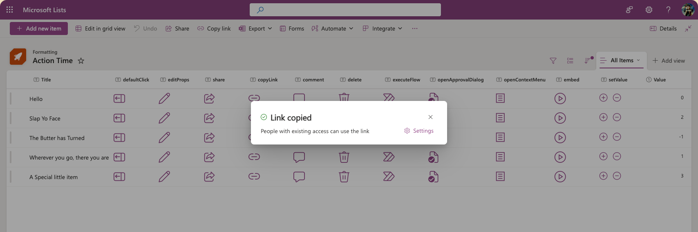

### comment (comment.json)
This action will open the list item and place the focus in the comment input box. This is equivalent to double-clicking an item and then clicking in the comment box.

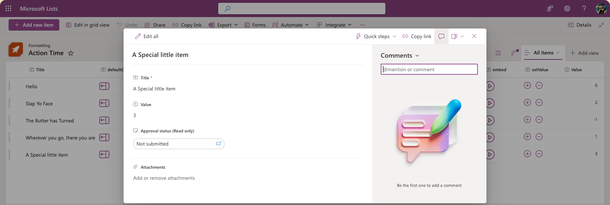

### delete (delete.json)
This action will prompt the user with a Deletion confirmation dialog and delete the item if they choose yes. This is equivalent to selecting the item and then pressing the `Delete` command bar button.

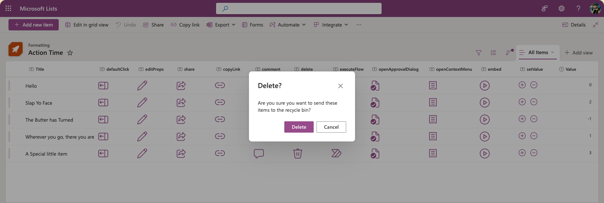

### executeFlow (executeFlow.json)
This action will launch a Power Automate flow for the item as the selected item. This action requires additional configuration through the `actionParams` property. The ID is always required, but you can also optionally include `headerText` and/or `runFlowButtonText` properties as well to customize the Flow panel.

>Note - the `headerText` and `runFlowButtonText` parameters are not available in SharePoint 2019

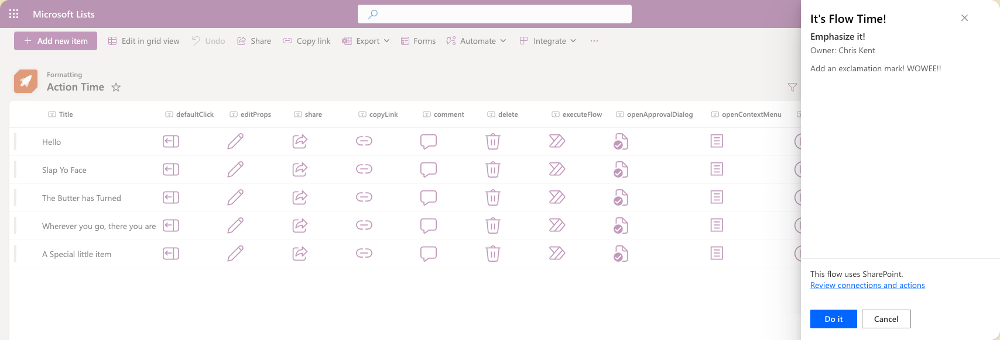

#### To obtain a Flow's ID:

1. Click _Flow_ > _See your flows_ in the SharePoint list where the Flow is configured
2. Click on the Flow you want to run
3. Copy the ID from the end of the URL

> Alternatively, this information is available in the Power Automate environment where your flow lives and can be found in flow details

#### actionParams

`actionParams` are JSON values but because they are inside a JSON format, they have to be entered as a JSON string value. In order to do that, you have to escape all the double quotes. So the JSON for `actionParams` may look like this:

```JSON
{
  "id": "f7ecec0b-15c5-419f-8211-302a5d4e94f1",
  "headerText": "It's Flow Time!",
  "runFlowButtonText": "Do it"
}
```

It has to be put into a single string value for the `actionParams` property so we put a backslash (`\`) in front of each double quote (`"`) and put it all on one line:

```JSON
"actionParams": "{\"id\":\"f7ecec0b-15c5-419f-8211-302a5d4e94f1\", \"headerText\":\"It's Flow Time!\",\"runFlowButtonText\":\"Do it\"}"
```

This value can even be written using expressions but you'll need to remember to build it with all the escapes as well.

```JSON
"actionParams": "='{\"id\":\"' + if([$Status] == 'New', 'f7ecec0b-15c5-419f-8211-302a5d4e94f1', 'b8rcwc6d-26d3-562n-5657-201b5a2c32d0') + '\"}'"
```

### openApprovalDialog (openApprovalDialog.json)
This action will open the Approval Dialog for the item (at whatever stage of approval it is in). This requires Content Approval to be enabled for the list/library. This is equivalent to selecting an item and pressing the `Request Approval` command bar button.

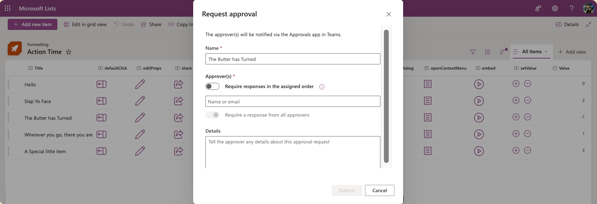

### openContextMenu (openContextMenu.json)
This action will open the context menu for an item. This is equivalent to right-clicking (or <kbd>CTRL</kbd>-clicking on Mac) and item.

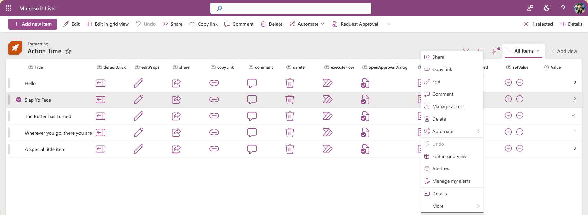

### embed (embed.json)
This action will open a callout with content embedded in it. You must specify the `src` value as part of `actionInput` to determine what content is loaded. You can also specify width and height of the callout using optional properties.

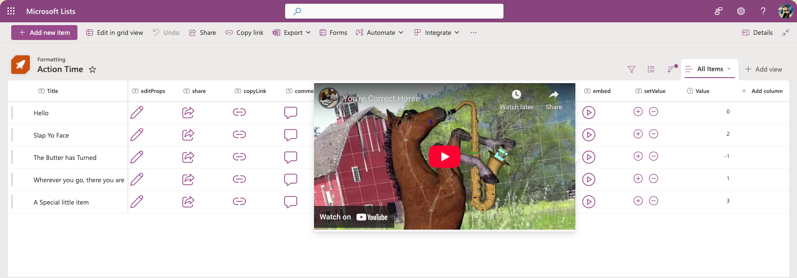

#### actionInput
There are 3 properties that can be set within `actionInput` with `src` being required.

- `src`: This is the embeddable URL of the content to load in the callout (via iframe)
- `width`: This is an optional property that determines the width of the callout in pixels. Enter the value as a plain number.
- `height`: This is an optional property that determines the height of the callout in pixels. Enter the value as a plain number.

#### Getting an embed URL
The `src` property is the URL of the embeddable content. You can generally find it as the `src` attribute of a generated `iframe` element on a site that provides `embed` options.

> Note - SharePoint restricts the domains that can be used for this. This can be adjusted on individual site collections or for the whole tenant. [Allow or restrict the ability to embed content on SharePoint Lists using custom formatters](https://go.microsoft.com/fwlink/p/?linkid=2258033)

For example, you can get an embed URL for a public YouTube video by clicking on **Share** then selecting **Embed** and copying the `src` value and the `width` and `height` values from the generated markup:

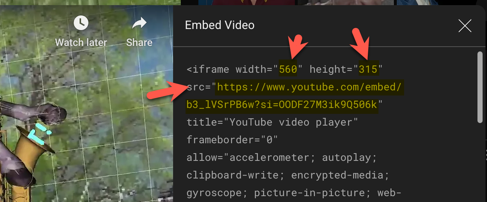

### setValue (setValue.json)
This action allows you to update the values of one or more fields for a given item. You specify the fields and their updated values using `actionInput`.

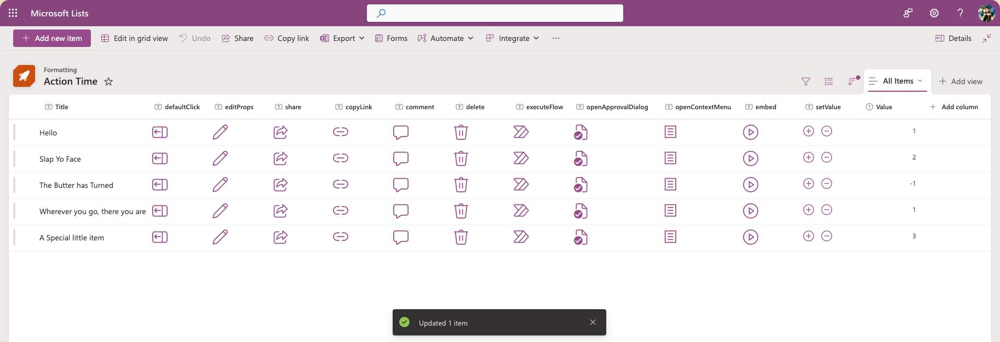

### previewFileAction (previewFileAction.json)
This action will open the default preview handler for the file directly in the library interface.

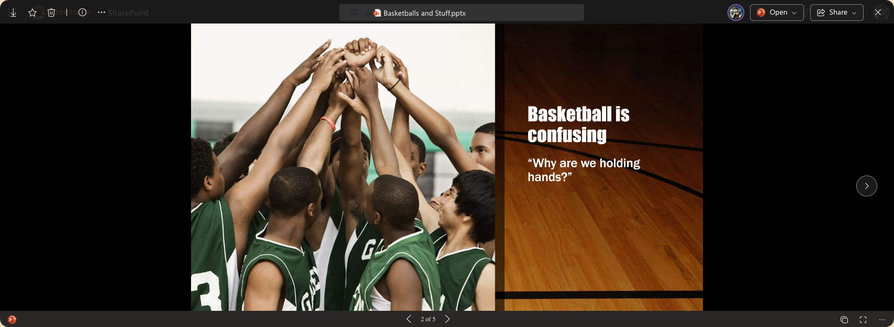

### copyFile (copyFile.json)
This action will send a copy of a file to another library. You specify the destination library and/or sub folder within that library using `actionParams`. This is equivalent to selecting a file and clicking the `Copy to` command bar button with the added benefit of already specifying the destination.

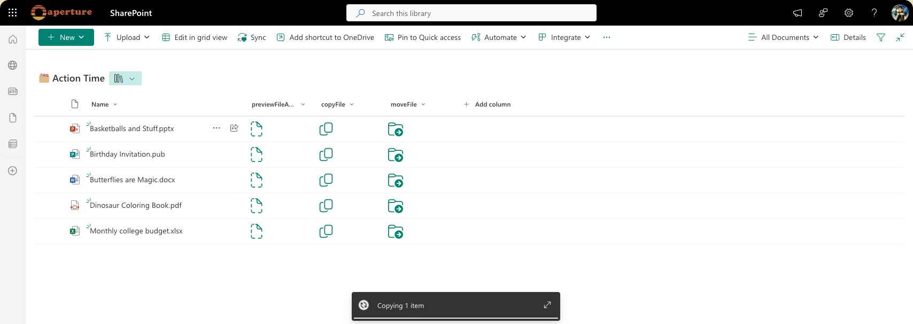

#### actionParams
Just like with `executeFlow` the `actionParams` are escaped JSON but there's currently only one property that needs to be specified: `destinationUrl`. This is a full URL (using `@currentWeb` to avoid hard coding your tenant) directly to the library and/or the folder within that library you want the file copied to.

User's permissions on the destination library/folder are not verified ahead of time and users without permission will receive an error.

### moveFile (moveFile.json)
This action will move a file to another library (removing it from the source library). You specify the destination library and/or sub folder within that library using `actionParams`. This is equivalent to selecting a file and clicking the `Move to` command bar button with the added benefit of already specifying the destination.

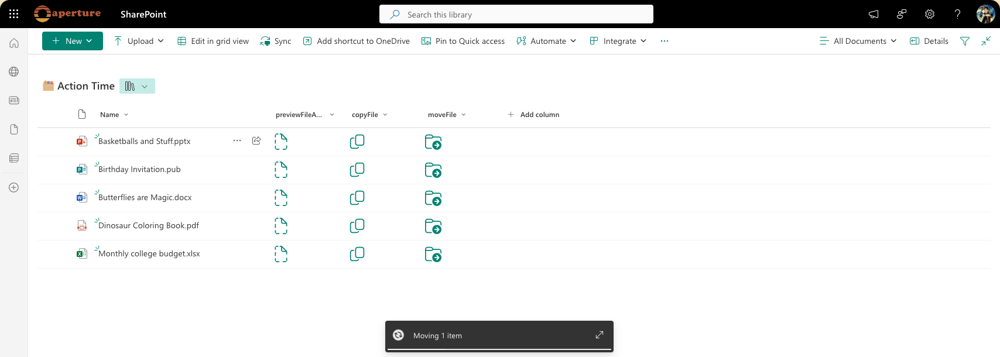

#### actionParams
Just like with `executeFlow` the `actionParams` are escaped JSON but there's currently only one property that needs to be specified: `destinationUrl`. This is a full URL (using `@currentWeb` to avoid hard coding your tenant) directly to the library and/or the folder within that library you want the file moved to.

User's permissions on the destination library/folder are not verified ahead of time and users without permission will receive an error.

## View requirements
- These formats can be applied to any column type (its value is ignored)
- If using the `executeFlow` action, the list/library is expected to have an associated Flow, the ID of this flow needs to be included in the `actionParams` for the button
- The `setValue.json` sample expects a number column named `Value`
- The `previewFileAction.json`, `copyFile.json`, and `moveFile.json` formats can only be used within document libraries

> Tip - You can apply these formats to a Calculated Column with a formula of `=""`. This makes it obvious the fields aren't expected to hold values and you can configure the columns of your form to hide them easily.

## Sample

Solution|Author(s)
--------|---------
generic-rowactions.json | [Chris Kent](https://github.com/thechriskent) ([@thechriskent](https://twitter.com/thechriskent))
editProps.json | [Chris Kent](https://github.com/thechriskent) ([@thechriskent](https://twitter.com/thechriskent))
share.json | [Chris Kent](https://github.com/thechriskent) ([@thechriskent](https://twitter.com/thechriskent))
copyLink.json | [Chris Kent](https://github.com/thechriskent) ([@thechriskent](https://twitter.com/thechriskent))
comment.json | [Chris Kent](https://github.com/thechriskent) ([@thechriskent](https://twitter.com/thechriskent))
delete.json | [Chris Kent](https://github.com/thechriskent) ([@thechriskent](https://twitter.com/thechriskent))
executeFlow.json | [Chris Kent](https://github.com/thechriskent) ([@thechriskent](https://twitter.com/thechriskent))
openApprovalDialog.json | [Chris Kent](https://github.com/thechriskent) ([@thechriskent](https://twitter.com/thechriskent))
openContextMenu.json | [Chris Kent](https://github.com/thechriskent) ([@thechriskent](https://twitter.com/thechriskent))
embed.json | [Chris Kent](https://github.com/thechriskent) ([@thechriskent](https://twitter.com/thechriskent))
setValue.json | [Chris Kent](https://github.com/thechriskent) ([@thechriskent](https://twitter.com/thechriskent))
previewFileAction.json | [Chris Kent](https://github.com/thechriskent) ([@thechriskent](https://twitter.com/thechriskent))
copyFile.json | [Chris Kent](https://github.com/thechriskent) ([@thechriskent](https://twitter.com/thechriskent))
moveFile.json | [Chris Kent](https://github.com/thechriskent) ([@thechriskent](https://twitter.com/thechriskent))

## Version history

Version|Date|Comments
-------|----|--------
1.0|April 18, 2019|Initial release
2.0|July 31, 2025|Additional actions

## Disclaimer
**THIS CODE IS PROVIDED *AS IS* WITHOUT WARRANTY OF ANY KIND, EITHER EXPRESS OR IMPLIED, INCLUDING ANY IMPLIED WARRANTIES OF FITNESS FOR A PARTICULAR PURPOSE, MERCHANTABILITY, OR NON-INFRINGEMENT.**

---

## Additional notes

- Additional samples of the `executeFlow` action can be found here:
  - [generic-start-flow](../generic-start-flow)
  - [generic-start-flow-conditionally](../generic-start-flow-conditionally)


