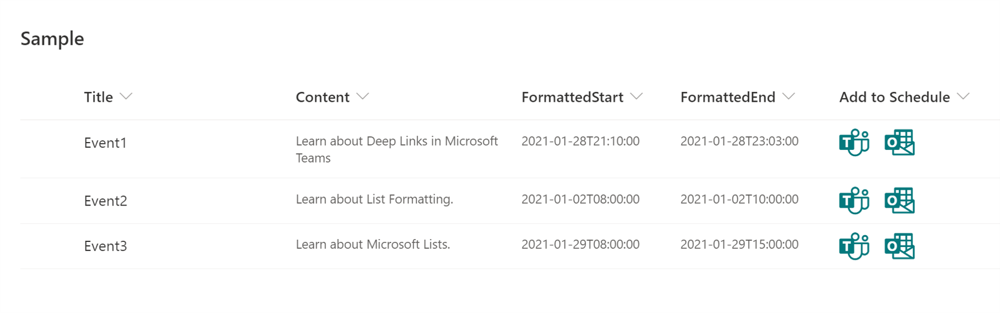
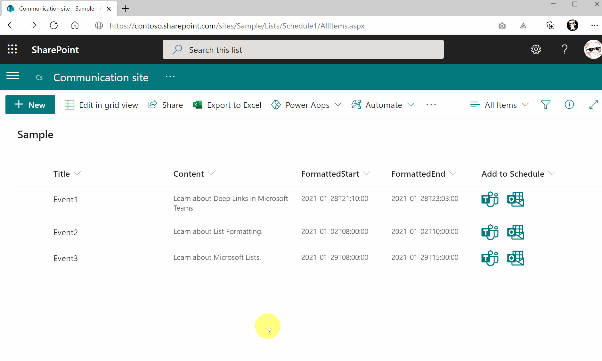

# Scheduling Dialog Links to MS Teams and Outlook

## Summary
This sample demonstrates creating deep links to the scheduling dialog in Microsoft Teams and Microsoft Outlook.

## View requirements
This format can be applied to any column type but expects the following columns to be part of the view:

|Type                 |Internal Name  |Required|
|---------------------|---------------|:------:|
|Single line of text  |Title          |Yes     |
|Multiple line of text|Content        |No      |
|Date and Time        |Start          |Yes     |
|Date and Time        |End            |Yes     |
|Calculated Column    |FormattedStart |        |
|Calculated Column    |FormattedEnd   |        |

You need `FormattedStart` and `FormattedEnd` Calculated Columns so that it shows ISO 8601 format date. The formula for these calculated columns is below:

`=TEXT([Start],"yyyy-mm-ddThh:mm:ss")`

`=TEXT([End],"yyyy-mm-ddThh:mm:ss")`

### Advanced Format

Alternatively, an additional format (generic-scheduling-link-advanced.json) is included that will eliminate the need for the Calculated Columns (`FormattedStart` & `FormattedEnd`). This is done by parsing the results of the `toLocaleTimeString` operation and is assuming results return in the format `h:mm:ss tt` (12 hour clock with minutes, seconds, and the ante/post meridiem indicator). This matches the local time format in the United States and several other countries.

These formulas have been put into the separate format because they are difficult to read and are not universally applicable. If you are targeting multiple regions with varying locale formats it is advised to use the calculated columns and the standard version of the format.

## Sample

Solution|Author(s)
--------|---------
generic-scheduling-link.json | [Tetsuya Kawahara](https://github.com/tecchan1107) ([@techan_k](https://twitter.com/techan_k))
generic-scheduling-link-advanced.json | [Tetsuya Kawahara](https://github.com/tecchan1107) ([@techan_k](https://twitter.com/techan_k)) & [Chris Kent](https://github.com/thechriskent) ([@thechriskent](https://twitter.com/thechriskent))

## Version history

Version |Date             |Comments
--------|-----------------|--------
1.0     |January 28, 2021 |Initial release

## Disclaimer
**THIS CODE IS PROVIDED *AS IS* WITHOUT WARRANTY OF ANY KIND, EITHER EXPRESS OR IMPLIED, INCLUDING ANY IMPLIED WARRANTIES OF FITNESS FOR A PARTICULAR PURPOSE, MERCHANTABILITY, OR NON-INFRINGEMENT.**

## Additional notes
- [Create deep links to content and features in Microsoft Teams](https://docs.microsoft.com/en-us/microsoftteams/platform/concepts/build-and-test/deep-links#generating-a-deep-link-to-the-scheduling-dialog)

