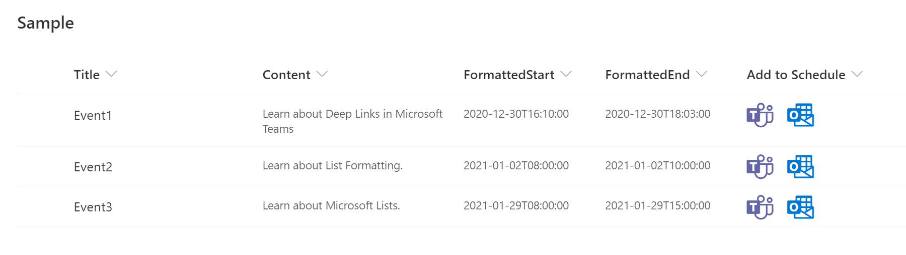
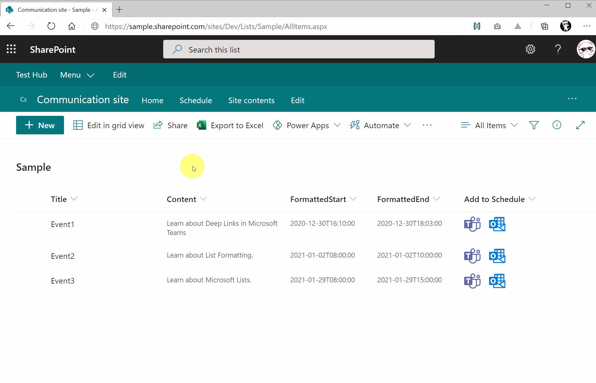

# Linking to the scheduling dialog in Microsoft Teams and Microsoft Outlook

## Summary
This sample demonstrates creating deep links to the scheduling dialog in Microsoft Teams and Microsoft Outlook.

## View requirements
This format can be applied to any column type but expects the following columns to be part of the view:

|Type                 |Internal Name  |Required|
|---------------------|---------------|:------:|
|Single line of text  |Title          |Yes     |
|Multiple line of text|Content        |No      |
|Date and Time        |Start          |Yes     |
|Date and Time        |End            |Yes     |
|Calculated Column    |FormattedStart |        |
|Calculated Column    |FormattedEnd   |        |

You need `FormattedStart` and `FormattedEnd` Calculated Columns so that it shows ISO 8601 format date. The formula for these calculated columns is below:

`=TEXT([Start],"yyyy-mm-ddThh:mm:ss")`

`=TEXT([End],"yyyy-mm-ddThh:mm:ss")`

## Sample
Solution                     |Author(s)
-----------------------------|---------------------------
generic-scheduling-link.json |[Tetsuya Kawahara](https://twitter.com/techan_k)

## Version history

Version |Date             |Comments
--------|-----------------|--------
1.0     |January 28, 2021 |Initial release

## Disclaimer
**THIS CODE IS PROVIDED *AS IS* WITHOUT WARRANTY OF ANY KIND, EITHER EXPRESS OR IMPLIED, INCLUDING ANY IMPLIED WARRANTIES OF FITNESS FOR A PARTICULAR PURPOSE, MERCHANTABILITY, OR NON-INFRINGEMENT.**

## Additional notes
- [Create deep links to content and features in Microsoft Teams](https://docs.microsoft.com/en-us/microsoftteams/platform/concepts/build-and-test/deep-links)

