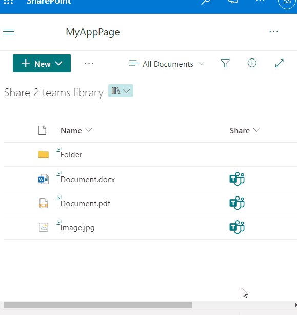

# Share to Teams

## Summary
This sample demonstrates how to add a "Share to Microsoft Teams" link into a document library.
A new tab is opened once a user clicks the "Teams" icon, then the user will be asked in which team and channel to post the document.

## View requirements

The format can be applied to any column, although it is recommended to add it to a calculated column with a `="1"` formula

## Sample

Solution|Author(s)
--------|---------
generic-share-to-teams.json | [Sven Sieverding](https://github.com/365knoten)

## Version history

Version|Date|Comments
-------|----|--------
1.0|August 15, 2023|Initial release

## Disclaimer
**THIS CODE IS PROVIDED *AS IS* WITHOUT WARRANTY OF ANY KIND, EITHER EXPRESS OR IMPLIED, INCLUDING ANY IMPLIED WARRANTIES OF FITNESS FOR A PARTICULAR PURPOSE, MERCHANTABILITY, OR NON-INFRINGEMENT.**

