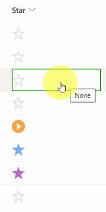

# Star Icons

## Summary
This sample formats a choice column to use the star icons similar to Gmail.

This sample requires a choice field with these options added:

- None
- Yellow Star
- Orange Star
- Red Star
- Purple Star
- Blue Star
- Green Star
- Alert
- Arrow
- Checkmark
- Info
- Question

Also, it uses `inlineEditField`, which allows the user to change the icon on the view.

## View requirements
- This format can be applied to a Choice column

## Sample

Solution|Author(s)
--------|---------
generic-star-icon.json | [Will Cooper](https://github.com/wwcoop)

## Version history

Version|Date|Comments
-------|----|--------
1.0|May 15, 2023|Initial release

## Disclaimer
**THIS CODE IS PROVIDED *AS IS* WITHOUT WARRANTY OF ANY KIND, EITHER EXPRESS OR IMPLIED, INCLUDING ANY IMPLIED WARRANTIES OF FITNESS FOR A PARTICULAR PURPOSE, MERCHANTABILITY, OR NON-INFRINGEMENT.**