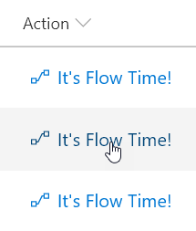

# Create a button to launch a Flow for the selected item

## Summary
You can use column formatting to create buttons that, when clicked, run Flows on the corresponding list item. The Flow Launch Panel will be displayed after clicking the button allowing the user to specify any required data and then run the flow.

To use the sample, you must substitute the ID of the Flow you want to run. This ID is contained within the `customRowAction` attribute inside the `button` element.

To obtain a Flow's ID:

1. Click _Flow_ > _See your flows_ in the SharePoint list where the Flow is configured
2. Click on the Flow you want to run
3. Copy the ID from the end of the URL

## View requirements
- This format can be applied to any column type (its value is ignored)
- The list is expected to have an associated Flow, the ID of this flow needs to be included in the `actionParams` for the button

> Tip - You can apply this format to a Calculated Column with a formula of `=""`. This prevents this field from being part of your edit/new forms.

## Sample

Solution|Author(s)
--------|---------
generic-start-flow.json | [Yannick Borghmans](https://github.com/yborghmans) ([@yborghmans](https://twitter.com/yborghmans))

## Version history

Version|Date|Comments
-------|----|--------
1.0|November 25, 2017|Initial release
1.1|January 22, 2018|Adjusted actionParams markup
1.2|August 18, 2018|Icon is now included in button and theme colors are used

## Disclaimer
**THIS CODE IS PROVIDED *AS IS* WITHOUT WARRANTY OF ANY KIND, EITHER EXPRESS OR IMPLIED, INCLUDING ANY IMPLIED WARRANTIES OF FITNESS FOR A PARTICULAR PURPOSE, MERCHANTABILITY, OR NON-INFRINGEMENT.**

---

## Additional notes
This sample is also covered in the main documentation around Column Formatting

A similar wizard is also included in the [Column Formatter](https://github.com/SharePoint/sp-dev-solutions/blob/master/solutions/ColumnFormatter/README.md) webpart that allows full customization.

- [Use column formatting to customize SharePoint](https://docs.microsoft.com/en-us/sharepoint/dev/declarative-customization/column-formatting)

