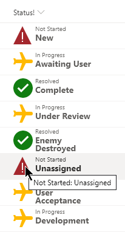

# Substring Status

## Summary
This format demonstrates using a combination of the `substring` and `indexOf` operations to "split" a value and make style decisions based on portions of the value. In this case the status values are separated with a colon (`:`). The first part is a general category such as Not Started, In Progress, or Resolved. The second part is the detailed reason for the status. Since these values are within the same column it becomes necessary to break the value apart.

The value before the colon is used to set an icon and font-color as well as being displayed in it's own `span` element. The value after the colon is used to display the details in a secondary `span` element.

## View requirements
- This format can be applied to a text/choice column but expects values similar to:
  - Not Started: New
  - Not Started: Delayed
  - Not Started: Unassigned
  - In Progress: Under Review
  - In Progress: Awaiting User
  - In Progress: Development
  - In Progress: Testing
  - In Progress: User Acceptance
  - Resolved: Complete
  - Resolved: Withdrawn
  - Resolved: As Designed
  - Resolved: Integration Failure
  - Resolved: Answered
  - Resolved: Can't Reproduce
  - Resolved: Enemy Destroyed

## Sample

Solution|Author(s)
--------|---------
generic-substring-status.json | [Chris Kent](https://github.com/thechriskent) ([@thechriskent](https://twitter.com/thechriskent))

## Version history

Version|Date|Comments
-------|----|--------
1.0|February 6, 2020|Initial release

## Disclaimer
**THIS CODE IS PROVIDED *AS IS* WITHOUT WARRANTY OF ANY KIND, EITHER EXPRESS OR IMPLIED, INCLUDING ANY IMPLIED WARRANTIES OF FITNESS FOR A PARTICULAR PURPOSE, MERCHANTABILITY, OR NON-INFRINGEMENT.**

---

## Additional notes

- [Use column formatting to customize SharePoint](https://docs.microsoft.com/en-us/sharepoint/dev/declarative-customization/column-formatting#me)

