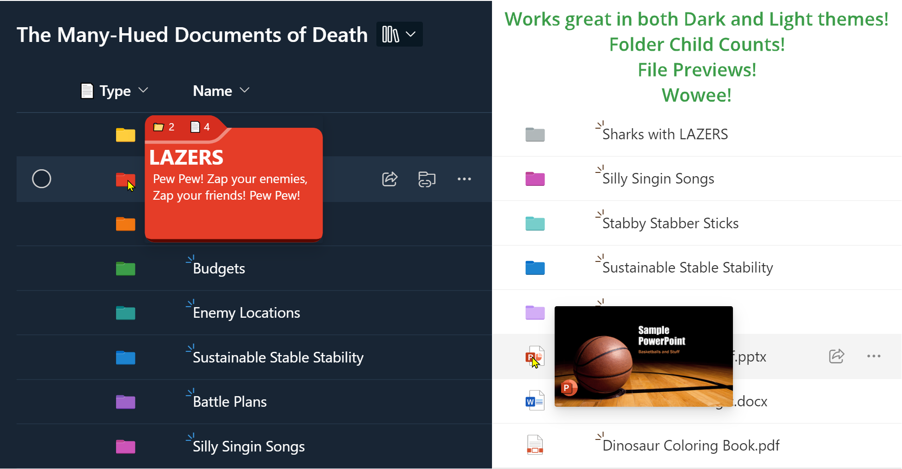

# Generic Super Type

## Summary
This sample demonstrates recreating the `Type` column (folder/file icons) and adds meaningful hover panels. Shows you how to take advantage of SharePoint folder colors by referencing the `[$_ColorHex]` field. Additionally, demonstrates 2 different ways of using the `filepreview` element to show a file type icon and also a thumbnail preview of the file.

### Folder Colors

|Color|_ColorHex value|
|---|---|
|Yellow|Empty or 0|
|Dark red|1|
|Dark orange|2|
|Dark green|3|
|Dark teal|4|
|Dark blue|5|
|Dark purple|6|
|Dark pink|7|
|Grey|8|
|Light red|9|
|Light orange|10|
|Light green|11|
|Light teal|12|
|Light blue|13|
|Light purple|14|
|Light pink|15|

## View requirements

This format can be applied to any column in your Document Library.

## Sample

Solution|Author(s)
--------|---------
generic-supertype.json | [Chris Kent](https://github.com/thechriskent)

## Version history

Version|Date|Comments
-------|----|--------
1.0|November 9, 2023|Initial release

## Disclaimer
**THIS CODE IS PROVIDED *AS IS* WITHOUT WARRANTY OF ANY KIND, EITHER EXPRESS OR IMPLIED, INCLUDING ANY IMPLIED WARRANTIES OF FITNESS FOR A PARTICULAR PURPOSE, MERCHANTABILITY, OR NON-INFRINGEMENT.**

---

## Additional notes

- [Use column formatting to customize SharePoint](https://docs.microsoft.com/en-us/sharepoint/dev/declarative-customization/column-formatting)
- [Create Folders with Colors using Power Automate](https://www.expiscornovus.com/2023/10/11/create-coloured-folder/) by [Expicornovus](https://pnp.github.io/List-Formatting/groupings/author/#dennis)
- [Create Folders with Colors using PnP.PowerShell](https://pnp.github.io/script-samples/spo-create-colored-folder/README.html?tabs=pnpps) by [Tetsuya Kawahara](https://pnp.github.io/List-Formatting/groupings/author/#tetsuya-kawahara) and [Ganesh Sanap](https://pnp.github.io/List-Formatting/groupings/author/#ganesh-sanap)

