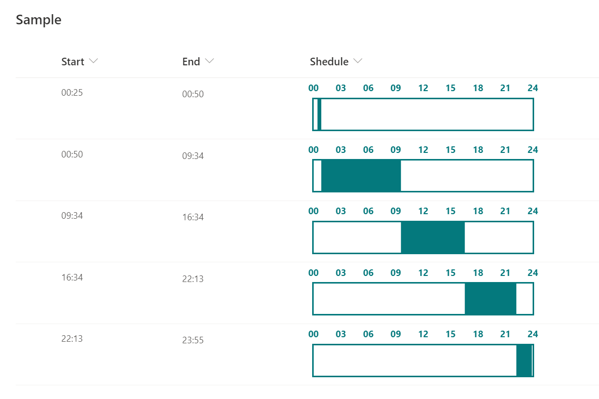

# Time Schedule

## Summary
This sample demonstrates a time schedule with a filled background from `Start` time to `End` time.

## View requirements
This format can be applied to any column type but expects the following columns to be part of the view:

|Type|Internal Name|Required|
|---|---|:---:|
|Single line of text or Choice|Start|Yes|
|Single line of text or Choice|End|Yes|

`Start` and `End` columns must be in `hh:mm` format.

## Sample

Solution                   |Author(s)
---------------------------|---------------------------
generic-time-schedule.json |[Tetsuya Kawahara](https://twitter.com/techan_k)

## Version history

Version |Date             |Comments
--------|-----------------|--------
1.0     |November 3, 2020 |Initial release

## Disclaimer
**THIS CODE IS PROVIDED *AS IS* WITHOUT WARRANTY OF ANY KIND, EITHER EXPRESS OR IMPLIED, INCLUDING ANY IMPLIED WARRANTIES OF FITNESS FOR A PARTICULAR PURPOSE, MERCHANTABILITY, OR NON-INFRINGEMENT.**

