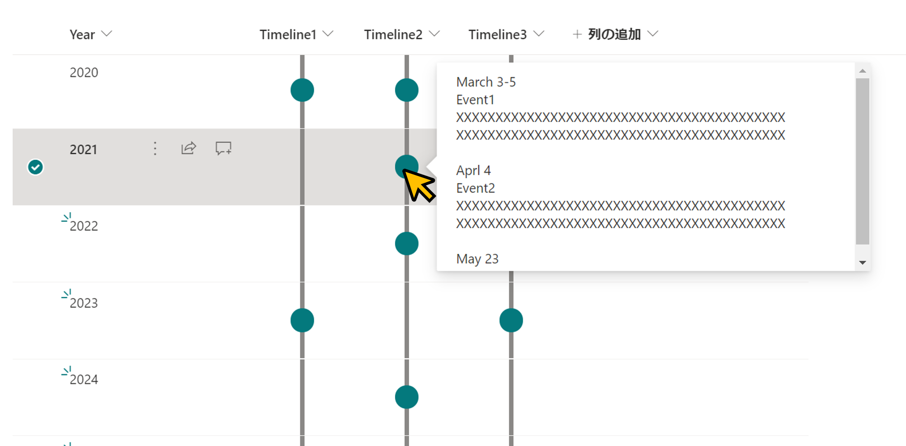

# Timeline Format

## Summary
This sample demonstrates displaying a timeline in a column. If the column value is empty, no circle will be displayed.

## View requirements
This format can be applied to any column type.

## Sample

Solution              |Author(s)
----------------------|------------------------------------------------
generic-timeline.json |[Tetsuya Kawahara](https://twitter.com/techan_k)

## Version history

Version |Date         |Comments
--------|-------------|----------------
1.0     |May 14, 2021 |Initial release

## Disclaimer
**THIS CODE IS PROVIDED *AS IS* WITHOUT WARRANTY OF ANY KIND, EITHER EXPRESS OR IMPLIED, INCLUDING ANY IMPLIED WARRANTIES OF FITNESS FOR A PARTICULAR PURPOSE, MERCHANTABILITY, OR NON-INFRINGEMENT.**

