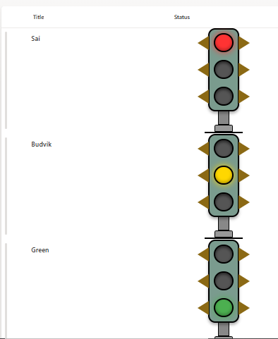

# Traffic Light Column Formatting

## Summary

This column formatting demonstrates how to create a **dynamic traffic light visual** within a SharePoint list using **column formatting JSON**. The traffic light displays different signal states (Red, Yellow, Green) with realistic styling including glowing effects, metal pole structure, and decorative side triangles.



## Features

- **Dynamic Light States:** Shows active light based on column value (Red, Yellow, or Green)
- **Realistic Visual Design:** 3D-styled traffic light with shadows and depth
- **Glowing Effect:** Active lights have a glowing shadow effect for realism
- **Decorative Elements:** Side triangular brackets for authentic traffic light appearance
- **Metal Pole Structure:** Complete with base mounting for visual completeness
- **Conditional Styling:** Only the active signal illuminates while others remain dark
- **Compact Design:** Fits within standard SharePoint list column widths

## Traffic Light States

The traffic light system displays three possible states based on the column value:

| Column Value | Active Light | Color | Effect |
|--------------|--------------|-------|--------|
| Red | Top Light | Red (#FF3333) | Glowing with red shadow |
| Yellow | Middle Light | Gold (#FFD700) | Glowing with yellow shadow |
| Green | Bottom Light | Green (#4CAF50) | Glowing with green shadow |

> **Note:** Only one light is active at a time. Inactive lights appear dark gray (#555) with inset shadows.

## View requirements

This formatting requires the following **column in your SharePoint list**:

| Column Name | Type | Accepted Values | Description |
|-------------|------|-----------------|-------------|
| Status | Choice | Red, Yellow, Green | Column where the formatting will be applied |

> **Important:** The column must be named "Status" and set as a Choice column with exactly three choices: "Red", "Yellow", and "Green" (case-sensitive).

## JSON Column Formatting Features

The JSON formatting includes several advanced visual features:

- **Conditional Background Colors:** Each light changes color based on the current field value
- **Dynamic Box Shadows:** Active lights glow with appropriate colored shadows
- **Inset Shadows:** Inactive lights have recessed appearance
- **CSS Triangles:** Side brackets created using pure CSS border tricks
- **Layered Z-index:** Proper stacking of visual elements
- **Structured Layout:** Metal housing, pole, and base components

## Visual Component Breakdown

### 1. **Housing Container**
- Green-gray background (#7a9b8e)
- Black border with rounded corners
- Drop shadow for 3D effect

### 2. **Signal Lights (3 units)**
- 35px circular lights
- Black borders
- Conditional glow effects
- Side decorative triangles (gold #8B6914)

### 3. **Mounting Pole**
- Gray metal finish (#888)
- Connects housing to base
- Black border for definition

### 4. **Base Components**
- Upper base: Light gray (#999)
- Ground line: Black separator

## How to Apply

1. **Prepare Your List:**
   - Create a **Choice column** named **"Status"**
   - Add exactly three choice values: **Red**, **Yellow**, **Green**
   - Optionally set a default value

2. **Apply Column Formatting:**
   - Open your **SharePoint list**
   - Click the **"Status"** column header → **Column settings → Format this column**
   - Switch to **Advanced mode**
   - Paste the provided JSON into the formatting editor
   - Click **Save**

3. **Set Column Values:**
   - Add/Edit list items
   - Select "Red", "Yellow", or "Green" from the Status dropdown
   - The traffic light will automatically update to show the selected state

## Customization Options

### Changing Colors
Modify the color hex codes in the JSON:
- Red light: `#FF3333`
- Yellow light: `#FFD700`
- Green light: `#4CAF50`
- Inactive lights: `#555`

### Adjusting Size
Modify these style properties:
- Light diameter: `width` and `height` (default: 35px)
- Housing width: (default: 60px)
- Pole dimensions: width 20px, height 30px

### Different Field Values
Replace `@currentField == 'Red'` with your custom values:
```json
"background-color": "=if(@currentField == 'Critical', '#FF3333', '#555')"
```

## Troubleshooting

### Lights Not Changing Color
- Verify the column is named exactly "Status" (case-sensitive)
- Ensure column values exactly match "Red", "Yellow", or "Green"
- Check that it's a Choice column, not Text
- Verify no extra spaces in choice values

### Visual Elements Not Aligned
- Clear browser cache
- Check if custom CSS is interfering
- Verify JSON syntax is valid

### Formatting Not Applied
- Confirm you're editing the correct column
- Validate JSON using online JSON validators
- Check SharePoint permissions

## Sample

Solution|Author(s)
--------|---------
generic-traffic-light-status.json | [Sai Bandaru](https://github.com/saiiiiiii)

## Version History

Version|Date|Comments
-------|----|--------
1.0|October 7, 2025|Initial release

## Disclaimer
**THIS CODE IS PROVIDED *AS IS* WITHOUT WARRANTY OF ANY KIND, EITHER EXPRESS OR IMPLIED, INCLUDING ANY IMPLIED WARRANTIES OF FITNESS FOR A PARTICULAR PURPOSE, MERCHANTABILITY, OR NON-INFRINGEMENT.**

## References

- [SharePoint Column Formatting Documentation](https://learn.microsoft.com/sharepoint/dev/declarative-customization/column-formatting)
- [JSON Schema for SharePoint Column Formatting](https://developer.microsoft.com/json-schemas/sp/v2/column-formatting.schema.json)


