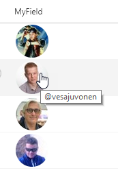

# Display Twitter profile pics using Twitter handles

## Summary

Using just the Twitter handle, Twitter profile pictures are displayed in a circle and clicking them will open the user's Twitter page in a new window. The handle is also displayed as a tooltip when hovering over the profile image.

### Image Size

[Twitter profile pictures](https://developer.twitter.com/en/docs/accounts-and-users/user-profile-images-and-banners) come in 3 standard sizes:

|Name|Size|
|---|:---:|
|mini|24x24|
|normal|48x48|
|bigger|73x73|

> There's actually another "size", `original`, that returns the image using the original proportions as uploaded by the user. This doesn't work well for listviews since there is so much variation, but it is available if you customize the code and change the relevant part of the `src` url to `?size=original`.

To change the size, adjust the portion of the `src` url to use the keyword from the table above and then adjust the `width` and `height` style attributes for the containing `div`.

### Column Types
This format will work with Choice and Text columns without any changes. To use Lookup columns, you'll need to change the 2 occurences of `@currentField` to `@currentField.lookupValue`.

The field values are case insensitve and should be just the user's twitter handle with no @.

## Sample

Solution|Author(s)
--------|---------
generic-twitterpic.json | [Chris Kent](https://twitter.com/thechriskent)

## Version history

Version|Date|Comments
-------|----|--------
1.0|March 21, 2018|Initial release

## Disclaimer
**THIS CODE IS PROVIDED *AS IS* WITHOUT WARRANTY OF ANY KIND, EITHER EXPRESS OR IMPLIED, INCLUDING ANY IMPLIED WARRANTIES OF FITNESS FOR A PARTICULAR PURPOSE, MERCHANTABILITY, OR NON-INFRINGEMENT.**

---

## Additional notes

A similar wizard is also included in the [Column Formatter](https://github.com/SharePoint/sp-dev-solutions/blob/master/solutions/ColumnFormatter/README.md) webpart that allows full customization.

- [Use column formatting to customize SharePoint](https://docs.microsoft.com/en-us/sharepoint/dev/declarative-customization/column-formatting)

