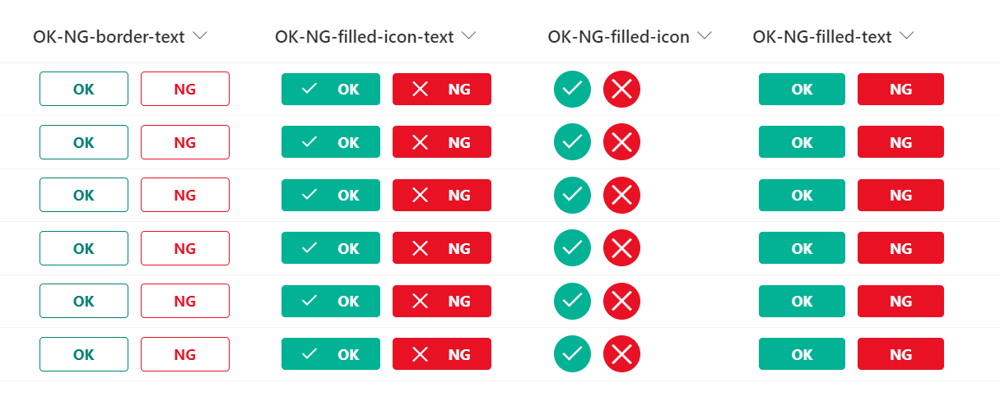

# Field Value Update Button

## Summary
This sample demonstrates displaying a button to update the fields values of an item.

In this sample, there are 8 types of buttons as follows.

### How to change the text on the button
If you want to change the text of the button, change the value of the `txtContent` property.

### How to change the icon
If you want to change the icon, refer to [Fluent UI Icons](https://developer.microsoft.com/en-us/fluentui#/styles/web/icons) and change the value of the `iconName` property.

### How to change the field to be updated
If you want to change the field to be updated, refer to [Microsoft Docs](https://docs.microsoft.com/en-us/sharepoint/dev/declarative-customization/formatting-advanced#set-multiple-field-values-of-an-item-using-customrowaction) and change the value of the `actionInput` property.

### How to set the button to show or hide
If you want to show or hide the button, change the value of the `display` property.

## View requirements
This format can be applied to any column type but expects the following columns to be part of the view:

|Type            |Internal Name |Required|
|----------------|--------------|:------:|
|Choice          |Status        |No      |
|Date and Time   |Date          |No      |
|Person or Group |User          |No      |

## Sample

Solution                                                |Author(s)
--------------------------------------------------------|---------------------------
generic-update-button-theme-color-border-text.json      |[Tetsuya Kawahara](https://twitter.com/techan_k)
generic-update-button-theme-color-filled-icon-text.json |[Tetsuya Kawahara](https://twitter.com/techan_k)
generic-update-button-theme-color-filled-icon.json      |[Tetsuya Kawahara](https://twitter.com/techan_k)
generic-update-button-theme-color-filled-text.json      |[Tetsuya Kawahara](https://twitter.com/techan_k)
generic-update-button-OK-NG-border-text.json            |[Tetsuya Kawahara](https://twitter.com/techan_k)
generic-update-button-OK-NG-filled-icon-text.json       |[Tetsuya Kawahara](https://twitter.com/techan_k)
generic-update-button-OK-NG-filled-icon.json            |[Tetsuya Kawahara](https://twitter.com/techan_k)
generic-update-button-OK-NG-filled-text.json            |[Tetsuya Kawahara](https://twitter.com/techan_k)

## Version history

Version |Date          |Comments
--------|--------------|--------
1.0     |April 2, 2022 |Initial release

## Disclaimer
**THIS CODE IS PROVIDED *AS IS* WITHOUT WARRANTY OF ANY KIND, EITHER EXPRESS OR IMPLIED, INCLUDING ANY IMPLIED WARRANTIES OF FITNESS FOR A PARTICULAR PURPOSE, MERCHANTABILITY, OR NON-INFRINGEMENT.**

