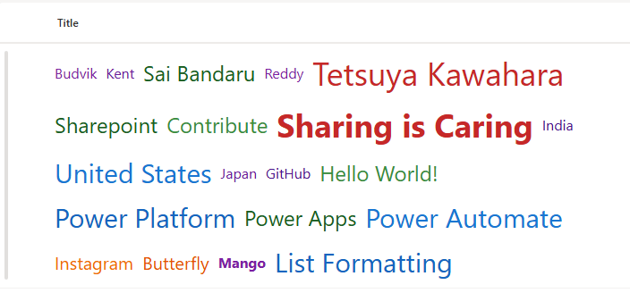

# SharePoint Word Cloud Column Formatting

This project demonstrates how to create a **dynamic and visually appealing word cloud** within a SharePoint list using **column formatting JSON**. The word cloud visualizes data from multiple label columns, applying **dynamic font sizes, colors, and bold styling** based on word characteristics.

## Features

- **Flexible Word Cloud Layout:** Uses `flex` and `flex-wrap` to automatically arrange words in multiple rows.
- **Dynamic Font Sizes:** Word size is calculated based on character length:
  - Words with **>15 characters** → `36px`
  - Words with **>12 characters** → `30px`
  - Words with **>9 characters** → `24px`
  - Words with **>7 characters** → `20px`
  - Words with **≤7 characters** → `16px`
- **Color Variation:** Each word is assigned a color based on thresholds to emphasize word importance and create a visually diverse cloud.
- **Bold Highlighting:** Specific words, like `"Sharing is Caring"` and `"Mango"`, are automatically displayed in **bold** for emphasis.
- **Responsive Design:** Layout adapts to different screen sizes and wraps words automatically.
- **Multi-column Support:** Displays words from **20 label columns** per item, making it ideal for survey data, tags, or keyword visualization.

## Supported Columns

This word cloud supports the following **columns in your SharePoint list**:

| Column Name | Description |
|-------------|-------------|
| Title     | Title |
| LABEL1    | Single Line of Text |
| LABEL2    | Single Line of Text |
| LABEL3    | Single Line of Text |
| LABEL4    | Single Line of Text |
| LABEL5    | Single Line of Text |
| LABEL6    | Single Line of Text |
| LABEL7    | Single Line of Text |
| LABEL8    | Single Line of Text |
| LABEL9    | Single Line of Text |
| LABEL10   | Single Line of Text |
| LABEL11   | Single Line of Text |
| LABEL12   | Single Line of Text |
| LABEL13   | Single Line of Text |
| LABEL14   | Single Line of Text |
| LABEL15   | Single Line of Text |
| LABEL16   | Single Line of Text |
| LABEL17   | Single Line of Text |
| LABEL18   | Single Line of Text |
| LABEL19   | Single Line of Text |
| LABEL20   | Single Line of Text |

> Each column represents a single word or short phrase that will appear in the word cloud. You can **extend beyond 20 labels** by adding more `span` elements in the JSON formatting code.

> You can extend beyond 20 labels by adding additional `span` elements in the JSON.

## JSON Column Formatting

The JSON formatting applies styles using conditional expressions:

- **Font Size** dynamically changes according to word length.
- **Color** changes to provide visual differentiation between words.
- **Bold Text** applied for highlighted words.
- **Layout** uses `display: flex` with `flex-wrap: wrap` and `gap` to arrange words cleanly.

> **Note:** SharePoint JSON formatting does **not support rotation or random positioning**, so words are displayed in a flexible grid rather than a fully freeform cloud.

## How to Apply

1. Open your **SharePoint list**.
2. Click the column header you want to format → **Column settings → Format this column**.
3. Switch to **Advanced mode**.
4. Paste the JSON provided in this project into the formatting editor.
5. Click **Save**. The column will render as a word cloud automatically.

## Example Visualization

Suppose your list has the following label columns:

| LABEL1           | LABEL2     | LABEL3    | LABEL4 |
|-----------------|-----------|-----------|--------|
| Sharing is Caring | Mango      | Banana    | Apple  |

The resulting word cloud will:

- Display `"Sharing is Caring"` and `"Mango"` in **bold**.
- Assign larger font size to longer words like `"Sharing is Caring"`.
- Wrap all words neatly across multiple rows.
- Apply varying colors to each word for better visual effect.
- Layout automatically wraps and adapts to screen size.

## Customization Tips

- **Adding More Words:** Extend the JSON by copying existing `` blocks and updating the column references (LABEL21, LABEL22, etc.).
- **Changing Thresholds:** Adjust the character limits and font sizes in the JSON expressions to fit your dataset.
- **Color Palette:** Replace the hex codes with your preferred colors to match branding or theme.
- **Bold Words:** Add or remove words in the conditional font-weight expressions to highlight other important words.

## Limitations

- **No Freeform Rotation:** SharePoint JSON formatting cannot rotate or arbitrarily position words. The layout is grid-based using flex wrap.
- **Maximum Columns:** JSON supports multiple columns, but extremely large numbers of labels may impact performance.
- **Text Only:** This solution works for text/label columns. Rich text or HTML may require preprocessing to extract plain words.

## Sample

Solution|Author
--------|---------
generic-word-cloud.json | [Sai Bandaru](https://github.com/saiiiiiii) ([LinkedIn](https://www.linkedin.com/in/sai-bandaru-97a946153/))

## Version history

Version|Date|Comments
-------|----|--------
1.0|September 2, 2025|Initial release

## Disclaimer
**THIS CODE IS PROVIDED *AS IS* WITHOUT WARRANTY OF ANY KIND, EITHER EXPRESS OR IMPLIED, INCLUDING ANY IMPLIED WARRANTIES OF FITNESS FOR A PARTICULAR PURPOSE, MERCHANTABILITY, OR NON-INFRINGEMENT.**

## References

- [SharePoint Column Formatting Documentation](https://learn.microsoft.com/sharepoint/dev/declarative-customization/column-formatting)
- [JSON Schema for SharePoint Column Formatting](https://developer.microsoft.com/json-schemas/sp/v2/column-formatting.schema.json)

