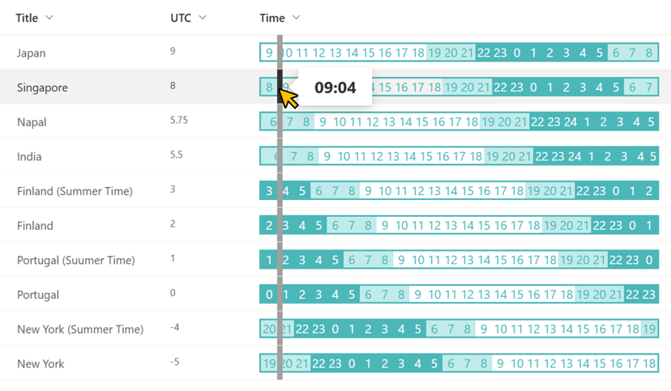

# World Current Time

## Summary
This sample demonstrates the side-by-side display and comparison of the current time in different countries around the world.

## View requirements
This format can be applied to any column type but expects the following columns to be part of the view:

|Type   |Internal Name |Required|
|-------|--------------|:------:|
|Number |UTC           |Yes     |

## Sample

Solution|Author(s)
--------|---------
generic-world-time.json | [Tetsuya Kawahara](https://github.com/tecchan1107) ([@techan_k](https://twitter.com/techan_k))

## Version history

Version |Date           |Comments
--------|---------------|--------
1.0     |April 17, 2022 |Initial release
1.1     |March 3, 2023  |Fixed to the method using the split operator.

## Disclaimer
**THIS CODE IS PROVIDED *AS IS* WITHOUT WARRANTY OF ANY KIND, EITHER EXPRESS OR IMPLIED, INCLUDING ANY IMPLIED WARRANTIES OF FITNESS FOR A PARTICULAR PURPOSE, MERCHANTABILITY, OR NON-INFRINGEMENT.**

