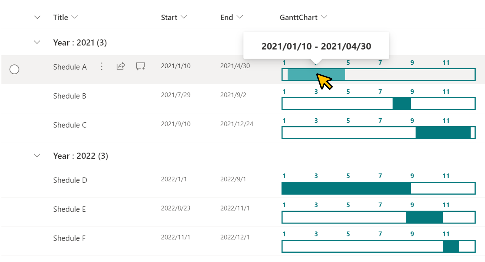

# Yearly Gantt Chart

## Summary
This sample demonstrates the display of a yearly Gantt chart.

- Schedules prior to the current date are shown with neutral colors
- Schedules containing the current date are shown with primary theme colors
- Schedules later than the current date are shown with light theme colors
- Year shown is the either the current year for active schedules,the last year of a past schedule, or the first year of a future schedule
- Full schedule date range is shown on hover

## View requirements

This format can be applied to any column type but expects the following columns to be part of the view:

|Type               |Internal Name|Required|
|-------------------|-------------|:------:|
|DateTime           |Start        |Yes     |
|DateTime           |End          |Yes     |

## Sample

Solution|Author(s)
--------|---------
generic-yearly-gantt-chart.json | [Tetsuya Kawahara](https://github.com/tecchan1107), [Chris Kent](https://github.com/thechriskent)
generic-yearly-gantt-chart-with-today.json | [Alvin Fong](https://github.com/hakki-max), [DRVRogo](https://github.com/DRVRogo), [Chris Kent](https://github.com/thechriskent)

## Version history

Version |Date          |Comments
--------|--------------|--------------------------------
1.0     |April 12, 2021|Initial release
1.1     |August 27, 2022|Added generic-yearly-gantt-chart-with-today.json
1.2.    |August 9, 2025|Latest year is prioritized in ranges that span across years (unless first year is current year), neutral colors used for ranges outside current year

## Disclaimer
**THIS CODE IS PROVIDED *AS IS* WITHOUT WARRANTY OF ANY KIND, EITHER EXPRESS OR IMPLIED, INCLUDING ANY IMPLIED WARRANTIES OF FITNESS FOR A PARTICULAR PURPOSE, MERCHANTABILITY, OR NON-INFRINGEMENT.**

