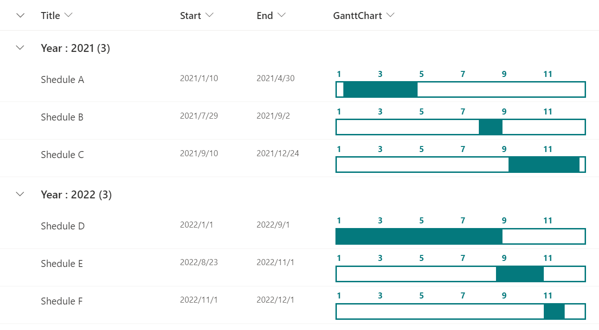

# Yearly Gantt Chart

## Summary
This sample demonstrates the display of a yearly Gantt chart.

## View requirements

|Type               |Internal Name|Required|
|-------------------|-------------|:------:|
|DateTime           |Start        |Yes     |
|DateTime           |End          |Yes     |
|Single line of text|GanttChart   |No      |

## Sample

Solution                    |Author(s)
----------------------------|---------------------------
emoji-link-tile-format.json |[Tetsuya Kawahara](https://twitter.com/techan_k)

## Version history

Version |Date          |Comments
--------|--------------|--------------------------------
1.0     |April 12, 2021|Initial release

## Disclaimer
**THIS CODE IS PROVIDED *AS IS* WITHOUT WARRANTY OF ANY KIND, EITHER EXPRESS OR IMPLIED, INCLUDING ANY IMPLIED WARRANTIES OF FITNESS FOR A PARTICULAR PURPOSE, MERCHANTABILITY, OR NON-INFRINGEMENT.**

