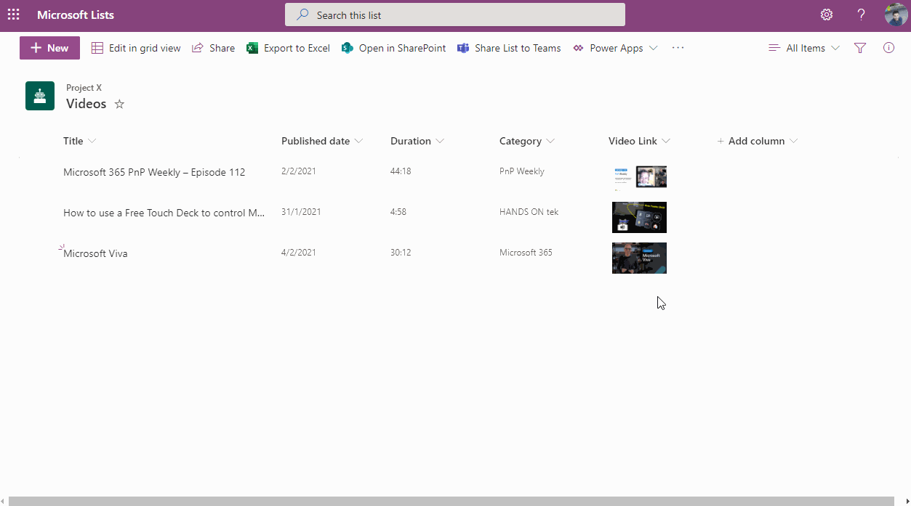

# YouTube Thumbnail

## Summary
This sample provides a thumbnail of a YouTube video that links to the video and a larger preview image on hover.

## View requirements
- This format can be applied to any text column but expects that value to be a URL to a YouTube video. The `Title` column is also used in the hover card.

## Sample

Solution|Author(s)
--------|---------
generic-youtube-thumbnail.json | [João Ferreira](https://github.com/joaoferreira) ([@joao12ferreira](https://twitter.com/Joao12Ferreira))

## Version history

Version|Date|Comments
-------|----|--------
1.0|February 10, 2021|Initial release

## Disclaimer
**THIS CODE IS PROVIDED *AS IS* WITHOUT WARRANTY OF ANY KIND, EITHER EXPRESS OR IMPLIED, INCLUDING ANY IMPLIED WARRANTIES OF FITNESS FOR A PARTICULAR PURPOSE, MERCHANTABILITY, OR NON-INFRINGEMENT.**

