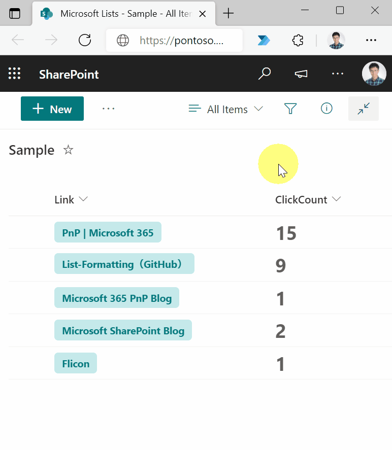

# Count the number of clicks on a link

## Summary
This sample demonstrates counting the number of clicks on a link. By keeping track of the number of link clicks, you can figure out which links are popular with users.

## View requirements

|Type      |Internal Name|Required|
|----------|-------------|:------:|
|Hyperlink |Link         |Yes     |
|Number    |ClickCount   |No      |

## Sample

Solution|Author(s)
--------|---------
hyperlink-click-count.json | [Tetsuya Kawahara](https://github.com/tecchan1107) ([@techan_k](https://twitter.com/techan_k))

## Version history

Version |Date              |Comments
--------|------------------|--------
1.0     |December 11, 2021 |Initial release

## Disclaimer
**THIS CODE IS PROVIDED *AS IS* WITHOUT WARRANTY OF ANY KIND, EITHER EXPRESS OR IMPLIED, INCLUDING ANY IMPLIED WARRANTIES OF FITNESS FOR A PARTICULAR PURPOSE, MERCHANTABILITY, OR NON-INFRINGEMENT.**

