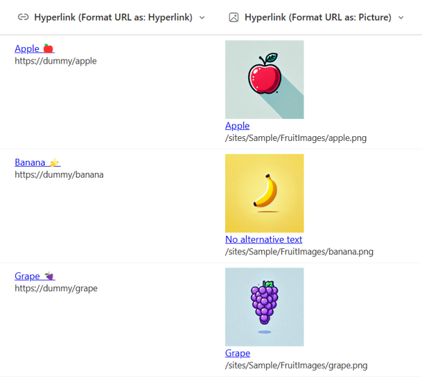

# Display URLs in Hyperlink Column

## Summary

This sample demonstrates displaying a URL in a hyperlink column. By showing the URL, users can preview the linked site or page before clicking on the link. Additionally, making the URL visible allows users to quickly identify the link’s destination during maintenance, making it easier to modify or update.

## View requirements

This format can be applied to a Hyperlink column.

## Sample

Solution|Author(s)
--------|---------
hyperlink-display-url.json | [Watana](https://github.com/watana2) & [Tetsuya Kawahara](https://github.com/tecchan1107)
hyperlink-display-url-format-picture.json | [Watana](https://github.com/watana2) & [Tetsuya Kawahara](https://github.com/tecchan1107)

## Version history

Version |Date            |Comments
--------|----------------|--------
1.0     |September 16, 2024 |Initial release

## Disclaimer
**THIS CODE IS PROVIDED *AS IS* WITHOUT WARRANTY OF ANY KIND, EITHER EXPRESS OR IMPLIED, INCLUDING ANY IMPLIED WARRANTIES OF FITNESS FOR A PARTICULAR PURPOSE, MERCHANTABILITY, OR NON-INFRINGEMENT.**

