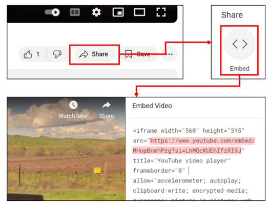
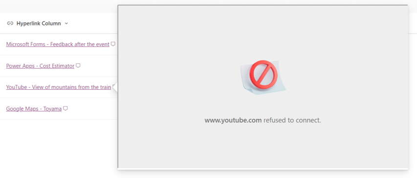

# Displaying Embedded Content Using the `embed` Action

## Summary

This sample demonstrates displaying embedded content using the `embed` action.

> [!NOTE]  
> - This sample and the `embed` action are only available in the newer version of the Microsoft Lists App.

## Prerequisites

### Allowing Embedding in HTML Field Security Settings

To embed content, the target site must be allowed for embedding. For guidance on how to allow embedding, please refer to [Allow or restrict the ability to embed content on SharePoint Lists using custom formatters](https://go.microsoft.com/fwlink/p/?linkid=2258033).

If you try to embed a site that is not allowed to be embedded, the following error screen will appear:

### Obtaining and Setting the Embedding URL

The URL in the hyperlink column must be set to an embedding URL. This URL is usually found in the `src` attribute of the `iframe` element.

For example, the embedding URL for YouTube can be obtained as follows:

1. Open the desired video on YouTube
1. Select the **Share** button
1. Select the **Embed** button
1. Copy the URL from the `src` attribute in the embed code

    

If the URL is not an embedding URL, the following error screen may appear:

## View requirements

This format can be applied to a Hyperlink column.

## Sample

Solution|Author(s)
--------|---------
hyperlink-embed.json | [Tetsuya Kawahara](https://github.com/tecchan1107)

## Version history

Version |Date            |Comments
--------|----------------|--------
1.0     |August 27, 2024 |Initial release

## Disclaimer
**THIS CODE IS PROVIDED *AS IS* WITHOUT WARRANTY OF ANY KIND, EITHER EXPRESS OR IMPLIED, INCLUDING ANY IMPLIED WARRANTIES OF FITNESS FOR A PARTICULAR PURPOSE, MERCHANTABILITY, OR NON-INFRINGEMENT.**

---

## Additional notes

- The `embed` action is described in [Formatting syntax reference - customRowAction](https://learn.microsoft.com/sharepoint/dev/declarative-customization/formatting-syntax-reference#customrowaction)

