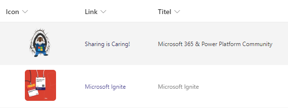

# Changing Image Hyperlink Standard Behavior

## Summary
If you click on an image in a SharePoint list, the image is displayed as a preview. This formatter changes the standard behavior in which a link from another column is used. In this way, a click on the image has the same behavior as if the link had been clicked directly.

## View requirements
- A column of type image containing this column formatter
- A hyperlink column (Internal Name: Link) that contains the target link.

## Sample

Solution|Author(s)
--------|---------
image-hyperlink.json | [Hagen Deike](https://github.com/samurai-ka) ([@samurai@sueden.social](https://sueden.social/@samurai))

## Version history

Version|Date|Comments
-------|----|--------
1.0|November 21, 2024|Initial release

## Disclaimer

**THIS CODE IS PROVIDED *AS IS* WITHOUT WARRANTY OF ANY KIND, EITHER EXPRESS OR IMPLIED, INCLUDING ANY IMPLIED WARRANTIES OF FITNESS FOR A PARTICULAR PURPOSE, MERCHANTABILITY, OR NON-INFRINGEMENT.**

---

## Additional notes

- Change the Image size on line 21
- To remove rounded corners, remove the image style on line 24-26
- Padding between the rows can be tweaked on line 6 & 7

