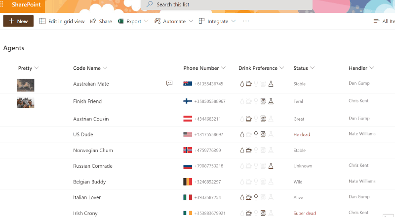
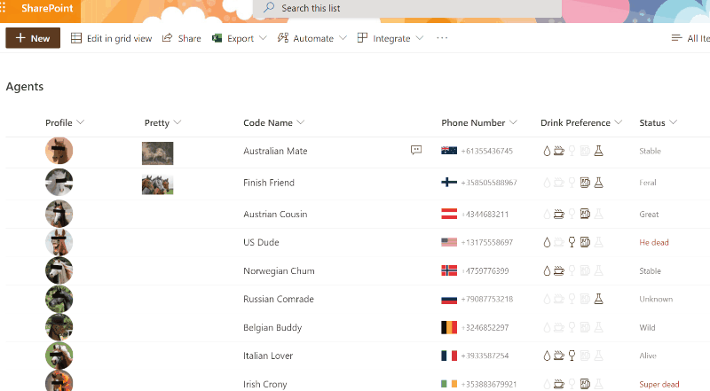

# Image Lightbox

## Summary
This sample demonstrates showing the full size image in a lightbox (hover card) rather than opening this image in a new window.

### Taking it further

An additional format (image-lightbox-advanced.json) is provided which demonstrates the same lightbox effects but dynamically scales the lightbox image based on the window size (50% of the rendered inner width/height). This format also adds a link in the bottom right corner of the hoverbox to open the image in a new window (matches the standard Image display behavior).

## View requirements
- This format can be applied to any image column type (Note: this sample does not work with the Picture column type)

## Sample

Solution|Author(s)
--------|---------
image-lightbox.json | [João Ferreira](https://github.com/joaoferreira) ([@joao12ferreira](https://twitter.com/Joao12Ferreira))
image-lightbox-advanced.json | [Chris Kent](https://github.com/thechriskent) ([@thechriskent](https://twitter.com/thechriskent))

## Version history

Version|Date|Comments
-------|----|--------
1.0|February 10, 2020|Initial release
1.1|July 8, 2021|Added advanced format
1.2|October 26, 2023|Updated samples to use getThumbnailImage

## Disclaimer
**THIS CODE IS PROVIDED *AS IS* WITHOUT WARRANTY OF ANY KIND, EITHER EXPRESS OR IMPLIED, INCLUDING ANY IMPLIED WARRANTIES OF FITNESS FOR A PARTICULAR PURPOSE, MERCHANTABILITY, OR NON-INFRINGEMENT.**

