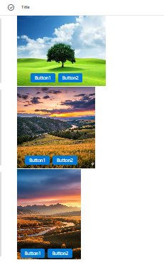

# Image with Overlay Buttons

## Summary

This column formatting sample displays images with action buttons overlaid at the bottom. The formatting dynamically adjusts image dimensions and button positioning based on the image orientation (Landscape, Portrait, or Square).



## View requirements

This format can be applied to any column in your SharePoint list or Microsoft List. The column itself doesn't need to contain specific data - the formatting references other columns in the list to display images and buttons.

### Required Columns

Your SharePoint list must have the following columns:

| Column Internal Name | Type | Description |
|---------------------|------|-------------|
| `Title` | Single line of text | Title |
| `ImageUrl` | Single line of text or Hyperlink | URL to the image to display |
| `ImageOrientation` | Choice | Image orientation: "Landscape", "Portrait", or "Square" |
| `Button1Label` | Single line of text | Text label for the first button |
| `Button1Url` | Hyperlink or Single line of text | URL for the first button action |
| `Button2Label` | Single line of text | Text label for the second button |
| `Button2Url` | Hyperlink or Single line of text | URL for the second button action |

### Setting Up the ImageOrientation Column

1. Create a **Choice** column named `ImageOrientation`
2. Add the following choices:
   - Landscape
   - Portrait
   - Square
3. Set a default value (recommended: "Landscape")

---

## Installation

1. Navigate to your **SharePoint list** or **Microsoft List**
2. Select the column you want to format (can be any column, such as Title)
3. Click the **column dropdown** menu
4. Select **Column settings** > **Format this column**
5. Click **Advanced mode**
6. **Copy the entire JSON code** from `image-overlay-buttons.json`
7. **Paste it** into the formatting panel
8. Click **Preview** to test the formatting
9. Click **Save** to apply the changes

## How It Works

This column formatting creates a custom rendering for each list item, displaying:
1. An image with dimensions based on orientation
2. Two action buttons overlaid at the bottom of the image

### Image Sizing by Orientation

The formatting applies different dimensions based on the `ImageOrientation` column:

| Orientation | Width | Height | Use Case |
|-------------|-------|--------|----------|
| **Landscape** | 250px | 200px | Wide images (16:9, 4:3) |
| **Portrait** | 180px | 260px | Tall images (9:16, 3:4) |
| **Square** | 220px | 230px | Equal dimensions (1:1) |

**Note**: For my use case, I’ve set the width and height as mentioned above. However, since the image is in landscape orientation (1980 × 1080), please adjust the code accordingly based on your scenario.

All images use `object-fit: cover` to fill the container while maintaining aspect ratio.

### Button Positioning

Buttons are positioned using negative margins that adapt to orientation:

- **Landscape**: -15% top margin, 15% left margin, 10px bottom padding
- **Portrait**: -20% top margin, 5% left margin, 5px bottom padding
- **Square**: -17% top margin, 10% left margin, 10px bottom padding

This ensures buttons appear consistently at the bottom of images regardless of orientation.

### Button Styling

Both buttons feature:
- Blue background (`#0078d4`)
- White text
- 4px border radius
- 13px font size
- 4px vertical padding, 12px horizontal padding
- 8px gap between buttons
- Opens links in new tab (`target="_blank"`)

## Customization Options

### Adjust Image Dimensions

Modify the width and height values for each orientation:

```json
"width": "=if(indexOf([$ImageOrientation],'Landscape')>-1, '250px', if(indexOf([$ImageOrientation],'Portrait')>-1, '180px', '220px'))"
```

Change the pixel values to your preferred sizes.

### Change Button Colors

Update the background color for both buttons:

```json
"background-color": "#0078d4"  // Default blue
```

Try these alternatives:
- `#107c10` - Green
- `#c4314b` - Red
- `#8764b8` - Purple
- `#038387` - Teal
- `#ca5010` - Orange

### Modify Button Styling

Adjust button appearance:

```json
"padding": "4px 12px",      // Button size
"border-radius": "4px",      // Corner rounding
"font-size": "13px"          // Text size
```

### Adjust Button Spacing

Change the gap between buttons:

```json
"gap": "8px"   // Default spacing
"gap": "12px"  // Wider spacing
"gap": "4px"   // Tighter spacing
```

### Fine-Tune Button Position

Modify the negative margin percentages:

```json
"margin-top": "=if(indexOf([$ImageOrientation],'Landscape')>-1, '-15%', if(indexOf([$ImageOrientation],'Portrait')>-1, '-20%', '-17%'))"
"margin-left": "=if(indexOf([$ImageOrientation],'Landscape')>-1, '15%', if(indexOf([$ImageOrientation],'Portrait')>-1, '5%', '10%'))"
```

Increase the percentage to move buttons up or left, decrease to move them down or right.

## Troubleshooting

### Images Not Displaying Correctly

**Problem**: Images appear stretched or distorted  
**Solution**: Ensure `ImageOrientation` column is set correctly for each image (must match exactly: "Landscape", "Portrait", or "Square")

**Problem**: Images don't load  
**Solution**: 
- Verify image URLs are accessible and valid
- Check that URLs include the protocol (https://)
- Ensure images aren't blocked by security policies
- Confirm image files exist at the specified URLs

### Buttons Not Positioned Correctly

**Problem**: Buttons appear too high or too low  
**Solution**: Adjust the negative margin percentages in the `margin-top` style

**Problem**: Buttons appear off to the side  
**Solution**: Modify the `margin-left` percentage values

**Problem**: Buttons don't show at all  
**Solution**: Check that button label and URL columns have data for each item

### Buttons Not Clickable

**Problem**: Clicking buttons doesn't work  
**Solution**:
- Verify URL columns (`Button1Url`, `Button2Url`) contain valid URLs
- Check SharePoint external link policies
- Ensure URLs include the protocol (https://)
- Test if pop-up blockers are interfering

### Button Text Not Showing

**Problem**: Buttons appear but no text visible  
**Solution**: 
- Check that `Button1Label` and `Button2Label` columns contain text
- Verify columns aren't hidden or filtered out
- Ensure text color contrasts with button background

### Column Formatting Not Applied

**Problem**: Column shows default values instead of formatted output  
**Solution**:
- Ensure JSON is valid (no syntax errors)
- Verify all referenced column names exist and match exactly (case-sensitive)
- Check that you have edit permissions on the list
- Try clearing browser cache and refreshing the page

## Known Limitations

1. **Manual Orientation Setting**: Users must manually set the `ImageOrientation` column for each image. Consider creating a Power Automate flow to automatically detect and set orientation.

2. **Fixed Button Count**: The formatting supports exactly two buttons. To add more buttons, you'll need to modify the JSON structure.

3. **Overlay Positioning**: Button positioning uses percentage-based negative margins, which may need fine-tuning for different image sizes or aspect ratios.

4. **External Links Only**: Buttons open in new tabs. To modify this behavior, remove or change the `target="_blank"` attribute.

## Best Practices

### Image Guidelines
- **Recommended sizes**: 
  - Landscape: 250px × 200px or larger (maintaining aspect ratio)
  - Portrait: 180px × 260px or larger
  - Square: 220px × 230px or larger
- **File format**: JPG or PNG
- **File size**: Keep under 2MB for optimal performance
- **Hosting**: Use SharePoint document libraries or approved CDN

### Button Labels
- Keep labels short (1-2 words)
- Use action verbs: "View", "Edit", "Download", "Open", "Share"
- Ensure button text contrasts well with button background
- Consider internationalization if used globally

### Performance
- Optimize images before uploading (compress without quality loss)
- Use appropriately sized images (don't upload 4K images if displaying at 250px)
- Consider pagination for lists with many items
- Test performance with expected data volume

## Sample

Solution|Author(s)
--------|---------
image-overlay-buttons.json | [Sai Bandaru](https://github.com/saiiiiiii) ([LinkedIn](https://www.linkedin.com/in/sai-bandaru-97a946153/))

## Version history

Version|Date|Comments
-------|----|--------
1.0|October 16, 2025|Initial release

## Disclaimer

**THIS CODE IS PROVIDED *AS IS* WITHOUT WARRANTY OF ANY KIND, EITHER EXPRESS OR IMPLIED, INCLUDING ANY IMPLIED WARRANTIES OF FITNESS FOR A PARTICULAR PURPOSE, MERCHANTABILITY, OR NON-INFRINGEMENT.**


## Use Cases

This column formatting is ideal for:

- **Image galleries** - Display product images with action links
- **Asset libraries** - Show documents/images with download and info buttons
- **Project portfolios** - Display project screenshots with links to details
- **Employee directories** - Show photos with contact and profile buttons
- **Event lists** - Display event images with registration and details links
- **Product catalogs** - Show products with "Buy" and "Details" buttons

## Accessibility Considerations

- Ensure sufficient color contrast for button text (current blue/white meets WCAG AA standards)
- Provide meaningful button labels that clearly describe actions
- Test keyboard navigation to ensure buttons are accessible
- Verify screen reader compatibility
- Consider adding descriptive alt text for images

