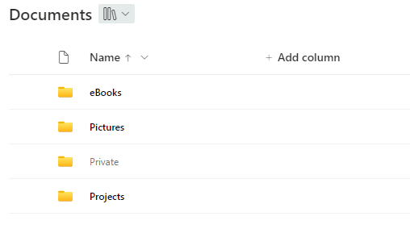

# Highlight non-empty folder

## Summary
This sample shows how folders can be highlighted or grayed out depending on whether they are empty or not.
It uses the 'Folder Child Count' and 'Item Child Count' columns to check if a folder is empty or not.

> Note - The sample can be easily adjusted to support only one of the columns. Just delete or replace the '||' and the according column in the json file

## View requirements
- This format can be applied to title column in a document library

## Sample

Solution|Author(s)
--------|---------
library-highlight-non-empty-folders | [Moritz Lickert](https://github.com/MoeIcI)

## Version history

Version|Date|Comments
-------|----|--------
1.0|October 6, 2023|Initial release

## Disclaimer
**THIS CODE IS PROVIDED *AS IS* WITHOUT WARRANTY OF ANY KIND, EITHER EXPRESS OR IMPLIED, INCLUDING ANY IMPLIED WARRANTIES OF FITNESS FOR A PARTICULAR PURPOSE, MERCHANTABILITY, OR NON-INFRINGEMENT.**

---
