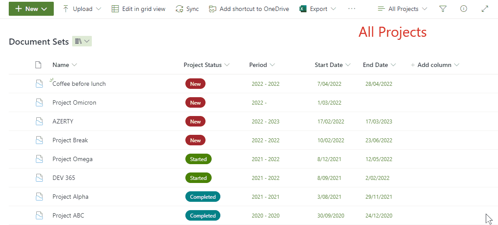

# Link to Parent Documentset

## Summary
The purpose of this sample is to enhance the use of documentsets. 
Assuming you have a SharePoint Library  with documentsets, it can be useful to create a view that shows all the files that without the documentset (folder) structure.
By adding a column to this view using this code, users can open the parent documentset of a file.

## View requirements
- A library with documentsets
- A view showing all the recent documents
-- Folders: "Show all items without folders"
-- Filter: Content Type is not equal to NameOfTheDocumentSetContentType
- A "Single line of text" column, the column doesn't need to be linked to any content type
- replace the "/sites/Sitecollection/Libriary name/" to the appropriate address of your library.

## Sample

Solution|Author(s)
--------|---------
link-to-parent-documentset.json | [Geert de Kooter](https://github.com/gdk-max) ([@gdekooter](https://twitter.com/gdekooter)), Learnia/Exceltrainer

## Version history

Version|Date|Comments
-------|----|--------
1.0|April 7, 2022|Initial release

## Additional notes
none

## Disclaimer

**THIS CODE IS PROVIDED *AS IS* WITHOUT WARRANTY OF ANY KIND, EITHER EXPRESS OR IMPLIED, INCLUDING ANY IMPLIED WARRANTIES OF FITNESS FOR A PARTICULAR PURPOSE, MERCHANTABILITY, OR NON-INFRINGEMENT.**

## Help

We do not support samples, but we this community is always willing to help, and we want to improve these samples. We use GitHub to track issues, which makes it easy for  community members to volunteer their time and help resolve issues.

If you encounter any issues while using this sample, [create a new issue](https://github.com/pnp/List-Formattings/issues/new?assignees=&labels=Needs%3A+Triage+%3Amag%3A%2Ctype%3Abug-suspected&template=bug-report.yml&sample=YOUR-SOLUTION-NAME&authors=@YOURGITHUBUSERNAME&title=YOUR-SOLUTION-NAME%20-%20).

For questions regarding this sample, [create a new question](https://github.com/pnp/List-Formattings/issues/new?assignees=&labels=Needs%3A+Triage+%3Amag%3A%2Ctype%3Abug-suspected&template=question.yml&sample=YOUR-SOLUTION-NAME&authors=@YOURGITHUBUSERNAME&title=YOUR-SOLUTION-NAME%20-%20).

Finally, if you have an idea for improvement, [make a suggestion](https://github.com/pnp/List-Formattings/issues/new?assignees=&labels=Needs%3A+Triage+%3Amag%3A%2Ctype%3Abug-suspected&template=suggestion.yml&sample=YOUR-SOLUTION-NAME&authors=@YOURGITHUBUSERNAME&title=YOUR-SOLUTION-NAME%20-%20).

> Update telemetry url below to place your sample name at the end then remove this line
