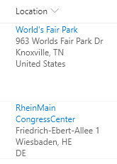

# Display Location Address Details

## Summary

Location columns provide several properties that can be accessed to provide more information to users. This sample pulls out sub properties to turn the standard Display Name only to a full address and provides a link to Bing Maps for a given location.

> Note: Location columns do not currently have the "Format this column" option in the column menu. Instead, formats to these columns need to be applied through the Field Settings screen for the column.

## View requirements
- This format can be applied to a location column

## Sample

Solution|Author(s)
--------|---------
location-address.json | [Chris Kent](https://github.com/thechriskent)
## Version history

Version|Date|Comments
-------|----|--------
1.0|August 21, 2019|Initial release

## Disclaimer
**THIS CODE IS PROVIDED *AS IS* WITHOUT WARRANTY OF ANY KIND, EITHER EXPRESS OR IMPLIED, INCLUDING ANY IMPLIED WARRANTIES OF FITNESS FOR A PARTICULAR PURPOSE, MERCHANTABILITY, OR NON-INFRINGEMENT.**

---

