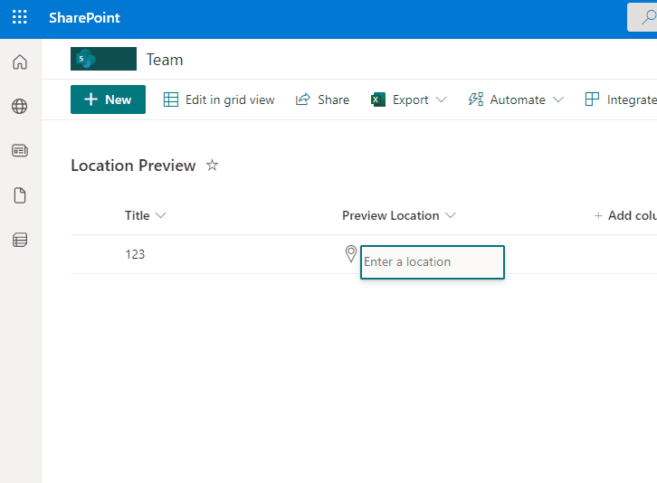

# Location Bing Maps

## Summary
This sample demonstrates how to use a Location column to display details and a Map from Bing.

## View requirements
- This format can be applied to any `Location` Column.

## Sample

Solution|Author(s)
--------|---------
location-bing-maps.json | [André Lage](https://github.com/aaclage) ([@aaclage](https://twitter.com/aaclage))

## Version history

Version|Date|Comments
-------|----|--------
1.0|May 27, 2022|Initial release

## Disclaimer
**THIS CODE IS PROVIDED *AS IS* WITHOUT WARRANTY OF ANY KIND, EITHER EXPRESS OR IMPLIED, INCLUDING ANY IMPLIED WARRANTIES OF FITNESS FOR A PARTICULAR PURPOSE, MERCHANTABILITY, OR NON-INFRINGEMENT.**

---

