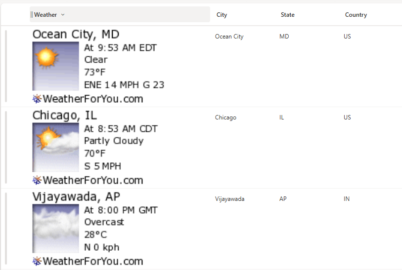

# Display Location Weather Details

## Summary

This SharePoint list formatting solution provides dynamic weather display capabilities using [WeatherForYou.com](https://www.weatherforyou.com/). The solution has evolved through multiple versions to support both location columns and individual city/state/country columns with enhanced flexibility and global coverage.

> **Note**: The WeatherForYou weather snapshots do NOT require an API key and is completely free to use. However, optimal results are achieved with locations within the United States, though international locations are supported with some limitations.

## Version Overview

This repository contains two versions of the weather display formatter:

- **Version 1.0**: Original location-based weather display (by Chris Kent)
- **Version 2.0**: Enhanced city/state/country-based weather display with improved international support (by Sai Bandaru)

---

## Version 1.0 - Location Column Weather Display

### Requirements
- Location column type in SharePoint list
- US-based locations for optimal results

### Implementation
Apply this format to a location column. To reference a location column, you can switch from `@currentField` to column reference format (e.g., `@currentField.Address.City` to `[$INTERNALNAME.Address.City]`)
---

## Version 2.0 - Enhanced City/State/Country Weather Display

### Features
- ✅ **Global Coverage**: Supports international locations (IN, US, etc.)
- ✅ **Flexible Column Structure**: Uses separate City, State, Country columns
- ✅ **Enhanced Styling**: Improved visual layout with better sizing
- ✅ **Dynamic Parameters**: URL encoding and case handling for better compatibility
- ✅ **Accessibility**: Proper alt text for screen readers

### Column Requirements
Create a SharePoint list with the following columns:

| Internal Name | Type | Description |
|---------------|------|-------------|
| **City** | Single line of text | City name (e.g., "Vijayawada", "Chicago") |
| **State** | Single line of text | State/Province code (e.g., "AP", "IL", "KA") |
| **Country** | Single line of text | Country code (e.g., "IN", "US") |
| **Weather** | Single line of text | Column where the JSON formatting is applied |

*Additional columns can be added as needed for your specific requirements.*

### Sample Data
| City | State | Country |
|------|-------|---------|
| Vijayawada | AP | IN |
| Chicago | IL | US |
| Ocean City | MD | US |
| Bengaluru | KA | IN |
| Mumbai | MH | IN |
| New York | NY | US |

### How Version 2.0 Works
- **Dynamic Weather Images**: Displays live weather snapshots for each list item
- **Global Support**: Works with international locations using country codes
- **Smart URL Encoding**: Handles city names with spaces and special characters
- **Responsive Design**: Images scale appropriately while maintaining aspect ratio
- **Enhanced Accessibility**: Includes descriptive alt text for each weather image

---

## Security Configuration

**CRITICAL**: Before weather images will display, configure SharePoint security settings:

1. Navigate to **SharePoint Admin Center**
2. Go to **Settings** > **Advanced Settings**
3. Find the **"HTML Field Security"** section
4. Add `www.weatherforyou.net` to the **allowed domains** list
5. Save the configuration

**Without this security configuration, images will not display due to SharePoint's content security policies.**

---

## Implementation Instructions

### For Version 1.0 (Location Column)
1. Create or use an existing list with a Location column
2. Apply the Version 1.0 JSON formatting to your location column
3. Configure security settings as described above

### For Version 2.0 (City/State/Country)
1. Create a new SharePoint list or modify an existing one
2. Add the required columns: City, State, Country, Weather
3. Apply the Version 2.0 JSON formatting to the Weather column
4. Configure security settings as described above
5. Add sample data to test the functionality

---

## Troubleshooting

### Common Issues
- **Images not displaying**: Check SharePoint security configuration
- **International locations not working**: Verify country code format (use standard abbreviations)
- **City names with spaces**: Version 2.0 automatically handles this with URL encoding
- **State code format**: Use standard state/province abbreviations

### Supported Formats
- **US States**: Use 2-letter codes (IL, CA, NY, etc.)
- **Indian States**: Use standard abbreviations (KA, AP, MH, etc.)
- **Countries**: Use 2-letter country codes (US, IN, CA, etc.)

---

## Sample Solutions

| Solution | Author(s) | Version |
|----------|-----------|---------|
| location-weather.json | [Chris Kent](https://github.com/thechriskent) ([@thechriskent](https://twitter.com/thechriskent)) | 1.0 |
| location-global-weather.json | [Sai Bandaru](https://github.com/saiiiiiii) ([LinkedIn](https://www.linkedin.com/in/sai-bandaru-97a946153/)) | 2.0 |

---

## Version History

| Version | Date | Author | Comments |
|---------|------|--------|----------|
| 1.0 | September 16, 2021 | Chris Kent | Initial release - Location column based |
| 2.0 | September 14, 2025 | Sai Bandaru | Enhanced version with global support and flexible column structure |

---

## Contributing

Feel free to contribute improvements, bug fixes, or additional features. Please ensure any changes maintain backward compatibility where possible and include appropriate documentation updates.

---

## Disclaimer

**THIS CODE IS PROVIDED *AS IS* WITHOUT WARRANTY OF ANY KIND, EITHER EXPRESS OR IMPLIED, INCLUDING ANY IMPLIED WARRANTIES OF FITNESS FOR A PARTICULAR PURPOSE, MERCHANTABILITY, OR NON-INFRINGEMENT.**

---

