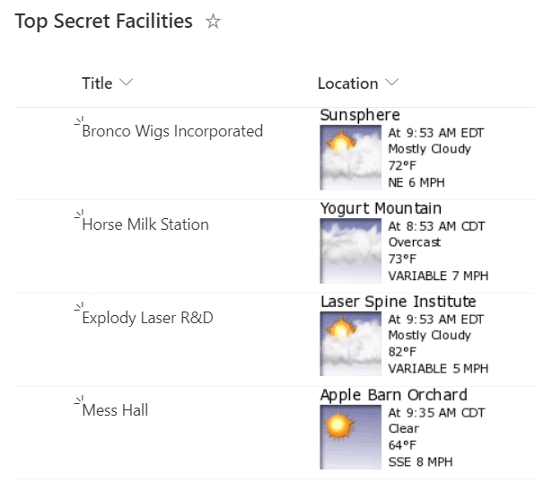

# Display Location Weather Details

## Summary

This sample utilizes sub properties of a Location column to build an image `src` that pulls weather from [WeatherForYou.com](https://www.weatherforyou.com/).

> [!NOTE] 
> The WeatherForYou weather snapshots do NOT require an API key and is completely free to use. However, it is limited to locations within the United States only. Locations outside of the US will not show the format.

## Prerequisites

This sample uses external images. These images are displayed only if their domains are explicitly allowed.

If your site allows only specific domains, add `www.weatherforyou.net` to the list of allowed domains in the **HTML Field Security** settings.

For more information, see: [Allow or restrict the ability to embed content on SharePoint pages](https://support.microsoft.com/office/allow-or-restrict-the-ability-to-embed-content-on-sharepoint-pages-e7baf83f-09d0-4bd1-9058-4aa483ee137b)

## View requirements
- This format can be applied to a location column (to reference a location column instead you can switch the calls from `@currentField` to the column reference format. For example, `@currentField.Address.City` to `[$INTERNALNAME.Address.City]`)

## Sample

Solution|Author(s)
--------|---------
location-weather.json | [Chris Kent](https://github.com/thechriskent)

## Version history

Version|Date|Comments
-------|----|--------
1.0|September 16, 2021|Initial release

## Disclaimer
**THIS CODE IS PROVIDED *AS IS* WITHOUT WARRANTY OF ANY KIND, EITHER EXPRESS OR IMPLIED, INCLUDING ANY IMPLIED WARRANTIES OF FITNESS FOR A PARTICULAR PURPOSE, MERCHANTABILITY, OR NON-INFRINGEMENT.**

---

