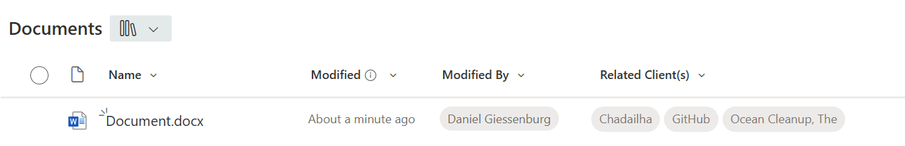
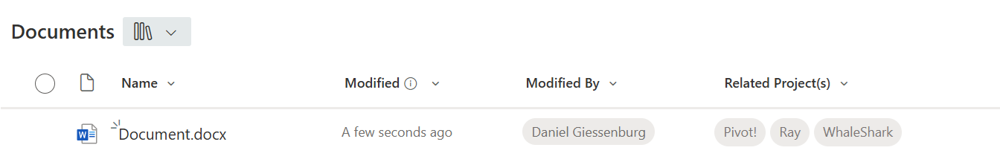
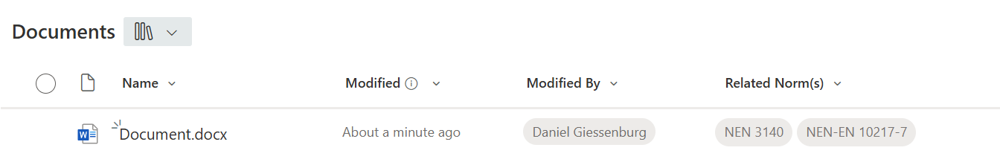

# Display Tags

## Summary
This sample demonstrates changing managed metadata (multiple) values to buttons that open (external) sites, documents or items on other links. Myself used this for redirecting users to information, like clients, projects or group related documents.

*Example of Related client(s) references on a document item within a SharePoint Document library*

*Example of Related projects(s) references on a document item within a SharePoint Document library*

*Example of Institute Norm reference(s) on a document item within a SharePoint Document library*

## View requirements
This format can be applied to a Managed Metadata column.

## How it works
For every value (term) of the metadata column, create a [HTML hyperlink](https://www.w3schools.com/tags/tag_a.asp) element (\<a\>) wrapped with a [HTML Content Division](https://www.w3schools.com/tags/tag_div.ASP) element (\<div\>).

[Hypertext reference](https://www.w3schools.com/tags/att_a_href.asp) (href) attribute of Hyperlink element (\<a\>) is loaded with URL (placeholder: [URL]) and the label of term.
For example: 
1. [URL] is replaced by: https://[tenant].sharepoint.com/sites/Client-
2. Term (label) equals Chadailha
3. Outcome is:
    - Label of button: Chadailha
    - Button action; open new (browser)window with site: https://[tenant].sharepoint.com/sites/Client-Chadailha

## How to use
1. Add a [Managed Metadata column](https://support.microsoft.com/en-us/office/create-a-managed-metadata-column-8fad9e35-a618-4400-b3c7-46f02785d27f) to the list/library
2. Copy JSON to code editor
3. Replace placeholder [URL], with desired hyperlink
4. Copy JSON from code editor
5. Paste JSON in column formatting, custom formatting textbox
6. Click on Save

## Sample

Solution|Author(s)
--------|---------
managed-metadata-button.json | [Daniel Giessenburg](https://github.com/DAGiessenburg) ([Lets'connect](https://www.linkedin.com/in/danielgiessenburg/))

## Version history

Version |Date               |Comments
--------|-------------------|--------
1.0     |June 26, 2025      |Initial release

## Additional Notes
- [Introduction to managed metadata](https://learn.microsoft.com/en-us/sharepoint/managed-metadata)

- [Create a Managed Metadata column](https://support.microsoft.com/en-us/office/create-a-managed-metadata-column-8fad9e35-a618-4400-b3c7-46f02785d27f)

- [Use column formatting to customize SharePoint](https://docs.microsoft.com/en-us/sharepoint/dev/declarative-customization/column-formatting)
 

## Disclaimer
**THIS CODE IS PROVIDED *AS IS* WITHOUT WARRANTY OF ANY KIND, EITHER EXPRESS OR IMPLIED, INCLUDING ANY IMPLIED WARRANTIES OF FITNESS FOR A PARTICULAR PURPOSE, MERCHANTABILITY, OR NON-INFRINGEMENT.**