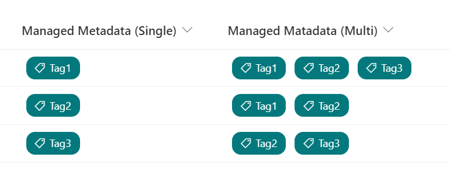

# Tag Icon

## Summary
This sample displays a tag icon to the left of the value in the managed metadata column.

## View requirements
This format can be applied to a Managed Metadata column.

## Sample

Solution                       |Author(s)
-------------------------------|---------------------------
managed-metadata-tag-icon.json |[Tetsuya Kawahara](https://twitter.com/techan_k)

## Version history

Version |Date           |Comments
--------|---------------|--------
1.0     |March 29, 2021 |Initial release

## Disclaimer
**THIS CODE IS PROVIDED *AS IS* WITHOUT WARRANTY OF ANY KIND, EITHER EXPRESS OR IMPLIED, INCLUDING ANY IMPLIED WARRANTIES OF FITNESS FOR A PARTICULAR PURPOSE, MERCHANTABILITY, OR NON-INFRINGEMENT.**

