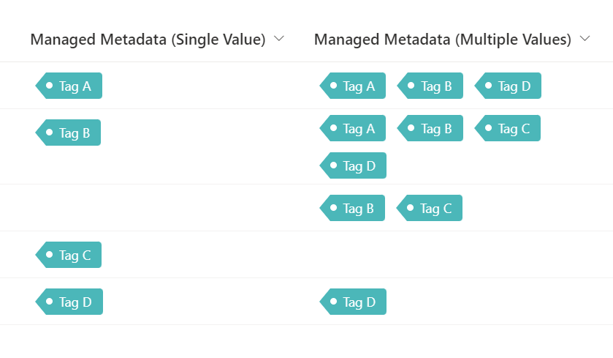

# Display Tags

## Summary
This sample demonstrates changing managed metadata values to tag-like appearance.

## View requirements
This format can be applied to a Managed Metadata column. Or it can be applied to a Choice Column too.

## Sample

Solution|Author(s)
--------|---------
managed-metadata-tag.json | [Tetsuya Kawahara](https://github.com/tecchan1107) ([@techan_k](https://twitter.com/techan_k))
managed-metadata-tag-multiple-values.json | [Tetsuya Kawahara](https://github.com/tecchan1107) ([@techan_k](https://twitter.com/techan_k))

## Version history

Version |Date               |Comments
--------|-------------------|--------
1.0     |September 17, 2023 |Initial release

## Disclaimer
**THIS CODE IS PROVIDED *AS IS* WITHOUT WARRANTY OF ANY KIND, EITHER EXPRESS OR IMPLIED, INCLUDING ANY IMPLIED WARRANTIES OF FITNESS FOR A PARTICULAR PURPOSE, MERCHANTABILITY, OR NON-INFRINGEMENT.**

