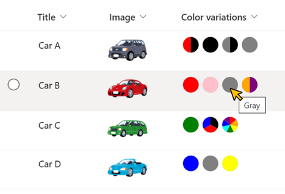
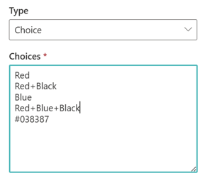

# Color Circles

## Summary
This sample demonstrates displaying circles of the color of the values of the choices. The circles are shown using SVG to display two-tone colors and various color schemes.

The value of the choices must be set to the HTML color code or HTML color name. (e.g. Red, #038387) Also, to set a two-tone or higher color scheme, a `+` must be set between colors. (e.g. Orange+Purple, Blue+Green+Gray)

## View requirements
- This format can be applied to a Multi-Select Choice column

## Sample

Solution|Author(s)
--------|---------
multi-choice-color-circles.json | [Tetsuya Kawahara](https://github.com/tecchan1107)

## Version history

Version |Date          |Comments
--------|--------------|--------
1.0     |July 17, 2023 |Initial release

## Disclaimer
**THIS CODE IS PROVIDED *AS IS* WITHOUT WARRANTY OF ANY KIND, EITHER EXPRESS OR IMPLIED, INCLUDING ANY IMPLIED WARRANTIES OF FITNESS FOR A PARTICULAR PURPOSE, MERCHANTABILITY, OR NON-INFRINGEMENT.**

