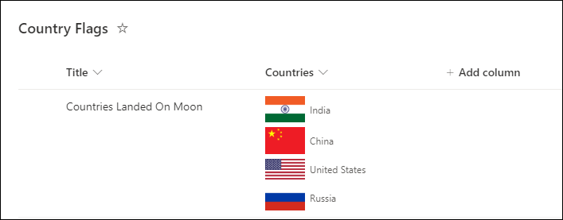
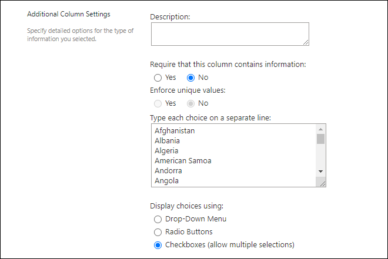

# Multiple Choice Country Flags

## Summary

This sample demonstrates displaying flags of the counties selected in the multiple selection SharePoint choice column.

The country flags are shown using the [FlagCDN - CDN & API of flags](https://flagcdn.com/) web site API. So, allow `flagcdn.com` domain in HTML Field Security settings of your SharePoint site by following this Microsoft official documentation: [Allow or restrict the ability to embed content on SharePoint pages](https://support.microsoft.com/en-us/office/allow-or-restrict-the-ability-to-embed-content-on-sharepoint-pages-e7baf83f-09d0-4bd1-9058-4aa483ee137b).

You can find the list of countries used in this JSON sample at: [Countries](./assets/countries.xlsx)

Add list of countries in the choice column settings like:

## View requirements

- This format can be applied to a multiple selection choice column

## Sample

Solution|Author(s)
--------|---------
multi-choice-country-flags.json | [Ganesh Sanap](https://github.com/ganesh-sanap)

## Version history

Version |Date          |Comments
--------|--------------|--------
1.0     |August 27, 2023 |Initial release

## Disclaimer
**THIS CODE IS PROVIDED *AS IS* WITHOUT WARRANTY OF ANY KIND, EITHER EXPRESS OR IMPLIED, INCLUDING ANY IMPLIED WARRANTIES OF FITNESS FOR A PARTICULAR PURPOSE, MERCHANTABILITY, OR NON-INFRINGEMENT.**

